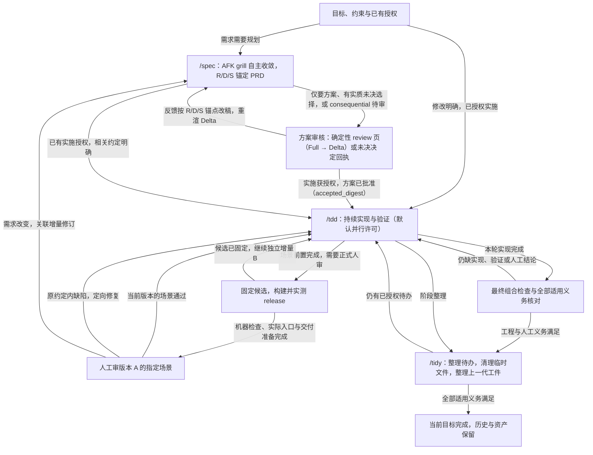
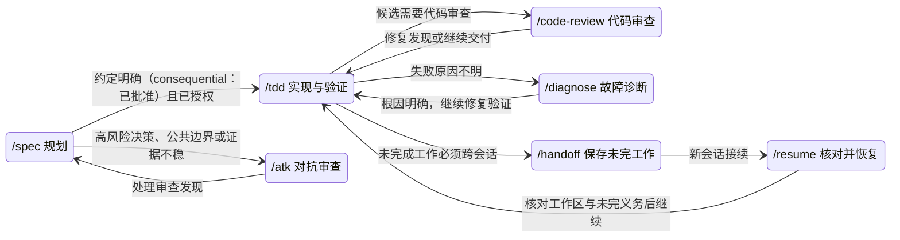

<div align="center">

# CosmosSkills

[GitHub](https://github.com/SilentUniverse/CosmosSkills) · [Issues](https://github.com/SilentUniverse/CosmosSkills/issues)

[](https://github.com/SilentUniverse/CosmosSkills/stargazers)
[](https://github.com/SilentUniverse/CosmosSkills/commits/main)


A complete engineering methodology for your coding agent — nine laws, an artifact gate, opt-in behavior evals, explicit execution ownership and recoverable workflow state.

</div>

***

## 这是什么

CosmosSkills 是一套给单人开发者的 AI 编程工程方法论：30 个跨宿主技能、九条设计定律、一道工件门和一套按需行为 eval。连续会话复用已核实的上下文，跨会话保留可校验的恢复入口；AI 的自我汇报不能代替证据。定律给方向，机器与可重放证据给结论。所有权衡按字典序处理：产品质量与正确性 > 交付速度 > Token 消耗；后两项不得削弱前一项的证据、安全或可访问性。

- **九条定律**：从 Hoare、Dijkstra、Parnas、Ousterhout 等软件工程经典提炼的九个问题。不给规范，让 AI 自己推导出好代码
- **机器门**：`verify-artifacts.py` 校验每份工件——完成记录点名的测试文件必须真实存在于磁盘，误删当场红灯；依赖图有环、PRD 版本链多头或缺头、需求记录源哈希漂移、R/D/S 锚点引用悬空、review 未批准先物化都会红灯
- **闭环工作流**：`/spec` 滚动规划需求与验证——consequential PRD 带 R/D/S 稳定锚点，经确定性 review 页人审，批准绑定 digest 后才拆卡；`/tdd` 在同一任务中持续实现和举证；`/tidy` 清理有明确归属的临时文件、把上一代工件整理成当前模型并保留测试经验。计划请求等审核；直接实施请求按已有授权继续
- **按需行为 eval**：默认关闭；项目内保留 previous / candidate / no-skill 配对实验，跨项目则导出同一份独立公开考卷，比较 Verified Success、速度、同口径成本与交接摩擦
- **单人本地优先**：本地 markdown 队列（pending | ready | done），零外部服务；中文沟通、沿用代码术语；面向人的输出以结果、证据和待决定事项为主

完整背景故事与设计出处见 [中文版](docs/introduction.zh.md) · [English](docs/introduction.en.md)。

批次、实时源码预览与固定 release 审核见 [日常使用说明](docs/checkpoint-local-release.zh.md)；
验证记录与量化方法见 [工作流审查](docs/checkpoint-workflow-review.zh.md)。

## 九条定律

SOLID、Clean Code 是下游经验——告诉 AI 该写成什么样，规则一多就记不住。这九条是上游定律——每个词一个问题，让 AI 自己推导；每条在工作流里都有一个指定执行点，强制力分三级——机器红灯、流程必经、自审判据。

| # | 定律 | 它问的一句话 | 在哪被执行 |
|---|---|---|---|
| 1 | First Principles | 为什么？ | `/grill` 从根本推导，不接受类比 |
| 2 | Invariant | 什么必须永远为真？ | PRD 实现决策先写不变量；AC 从不变量推导 |
| 3 | Parsimony | 还能删掉什么？ | 选型阶梯逐级下行；对抗自审问「想象未来的抽象」；spec §3 计划时对每个抽象点名消费者；完成时删除无消费者的新增，深审 `/atk` |
| 4 | Locality | 影响能否限制在这里？ | 切卡算推理半径；两轴测试进 `CODEBASE.md` |
| 5 | Provability | 为什么确信它对？ | 等价设计选正确性论证更短者 |
| 6 | Adversarial Review | 怎么把它打爆？ | 高风险 spec 收尾 `/atk`；完成时双轴审查，有具体发现才落 `审查` 字段 |
| 7 | Empiricism | 现实数据怎么说？ | 观测压倒推理；性能主张必须带测量 |
| 8 | Reversibility | 错了能回来吗？ | 单向门单独标出吃最重审查；`PRD-v2` 对账 |
| 9 | Evolution | 最小正确下一步是什么？ | 首卡 = 最小可工作核心；宽重构 expand→contract |

---

## 三十秒装上

Windows，clone 完双击 `install.cmd`。

```bash
git clone https://github.com/SilentUniverse/CosmosSkills
```

macOS / Linux。

```bash
git clone https://github.com/SilentUniverse/CosmosSkills
cd CosmosSkills
bash scripts/install.sh
```

装完新开会话，敲 `/` 可检查技能发现情况。只想试试全局规则，不装技能，拉一份 CLAUDE.md 也行。

```bash
curl -fsSL https://raw.githubusercontent.com/SilentUniverse/CosmosSkills/main/claude/CLAUDE.md -o ~/.claude/CLAUDE.md
```

Windows（PowerShell）等价命令；`curl` 裸名在 PS 5.1 是 `Invoke-WebRequest` 别名，必须用 `curl.exe`：

```powershell
curl.exe -fsSL https://raw.githubusercontent.com/SilentUniverse/CosmosSkills/main/claude/CLAUDE.md -o "$env:USERPROFILE\.claude\CLAUDE.md"
```

Codex 在本仓库通过根 [AGENTS.md](AGENTS.md) 读取共享策略 [CLAUDE.md](claude/CLAUDE.md)，避免维护两份正文。
安装器分发 Claude Code/ZCode 配置，并把技能镜像到 `~/.agents/skills`，ZCode 也从该根发现技能。`~/.zcode/skills` 里指向本仓库的镜像链接会在重装时移除，避免每个技能驻留加载两份。不会修改全局 `~/.codex/AGENTS.md`。
显式指定安装目标或 ClaudeRoot 时，不镜像到用户级 ZCode / agents 目录；隔离安装需同时指定这两个路径。
在其他 Codex 项目使用这套常驻策略时，将共享文件的实际路径加入相应 AGENTS.md，并保留原有项目规则。

新项目直接用 `/spec` 起步即可。`.scratch/` 本地 issue、三态词汇和 `CODEBASE.md`
验证命令区懒出生都是默认约定，无需 setup。`/cosmos-setup` 只处理偏离：非默认
tracker/路径、遗留状态、旧 `docs/agents/domain.md` 折叠。

---

## 工作流

**围绕可验证、可试用的用户场景持续交付。AI 在同一目标下推进实现、验证和反馈修复，人在需要判断产品效果或作实质决定时介入。**

Spec、TDD、TIDY 分别负责规划、执行和整理，在同一任务中接续。小而明确的修改直接实施，文件数不是规划门槛；
复杂需求由 Spec 先自主收敛（AFK grill：自查可答的问题、自担安全默认、自攻一版草案），产出带 R/D/S 稳定锚点的
PRD；consequential 方案经 `spec-review.py` 确定性投影成人审页：目标、风险聚合与变化项一屏可扫，人按锚点反馈，
AI 只重推受影响子树并重渲 Delta，批准写入 `accepted_digest`，机器门拒绝未批准先物化与批准后改稿。
需要持久任务队列时才拆 Issue，需要维护共享产品决定时才写 PRD，需要固定验收或持续批次协调时才启用 managed batch。

工程完成、人工通过和目标完成分别记录：Issue `done` 表示工程证据完整；人工接受绑定实际版本和场景；
当前目标只有在全部适用的工程、人工和清理义务满足后才完成。PRD、Issue、审查点不一一对应。
例如，解析文件、复制文件和取消操作三张卡，可以共同组成一个“导入素材”的可审场景。

### 主流程与人工审查

图中的分支允许并行推进：人审固定版本 A 时，TDD 可以继续独立增量 B；依赖审查决定的工作等待该决定。
consequential 方案走确定性 review 页（Full→Delta）；settled 小改动不经方案审核、直接实施，也不必人工验收；明确只要方案时，Spec 交出方案等待审核。



| 入口 | AI 负责 | 你主要提供 |
|---|---|---|
| [Spec](workflow/spec/SKILL.md) | 自主收敛需求树（可答自答、可默认自默认、对抗自审一次），产出 R/D/S 锚点 PRD；consequential 方案经确定性 review 页人审，批准绑定 accepted_digest 后才拆卡和跑预检；需求变化保留原完成历史并关联修订 | 目标、约束、优先场景与必要产品决定；review 页上按锚点的反馈或批准 |
| [TDD](workflow/tdd/SKILL.md) | 实现、验证、协调 worker、准备可审版本、定位并修复反馈 | 实际试用观察和明确版本的场景结论 |
| [TIDY](workflow/tidy/SKILL.md) | 展示工程与人工待办，清理已释放且无消费者的临时文件，把上一代工件整理成当前模型；保留测试、经验、交付版本和必要证据 | 查看或清理的目标范围 |

源码预览直接运行原仓库，使用现有依赖，允许继续写入，适合快速看效果。正式接受绑定已实测 release 的产物哈希。
构建安排在交付或必要的包验证节点；同一份已交付产物反复查看和导出直接复用。人工主要判断产品行为、体验及必要的真实业务操作，
AI 负责测试质量和证据关联；构建或检查失败不能靠一次人工批准变成通过。

### 辅助 Skill 的状态切换

辅助 Skill 在对应问题出现时调用；回到原目标继续工作。图中的状态表示当前职责，人工对固定版本的审核独立记录。



`/atk` 也可手动审查已有变更；`-r` 只读并返回发现。提交获得授权后，通过验证的修改进入 `/pr`；
模型行为对照试验使用显式启用的 `/eval`。这两项不会因队列为空自动触发。

### 日常使用怎样减少重复工作

- **一次交代目标、优先场景和实施授权。** “按方案全部做完，导入可完整试用时给我固定版，期间继续独立的搜索功能。”同范围规划、拆卡和修复沿用授权，不逐卡等待确认。
- **围绕场景反馈。** 说明试用版本、操作、实际现象和期望结果，AI 定位相关 Issue。需求完成后发生变化，追加关联修订；只有活动批次既定的失败恢复路径可以重新打开相关完成卡。
- **按影响范围验证，在交付边界汇总。** 局部修改跑相关用例，模块完成检查消费者，审查点验证场景与实际产物，最终候选完成全部适用检查。未知影响扩大范围；显式全量绕过筛选。
- **主控收口共享工作。** worker 只做写集和运行资源独立的工作，主控协调共享验证与交付；受管批次合并相同活动检查，完成证据只在有效性条件满足时复用。没有安全工作就等待事件。
- **阶段结束整理，同一目标持续接续。** `/tidy inspect 目标` 只查看；`/tidy 目标` 清理确认无用的临时文件；`/tidy -old <范围>` 把上一代工件整理成当前模型（旧 handoff 正文、复制式的卡片上级、被取代的草稿）。确需跨会话时使用 handoff/resume，保留测试、可复用经验和历史证据。

裸 `/tdd`、`/tidy` 默认当前目标；全仓操作需要明确范围，`/tdd -all` 表示全量检查。
`/tdd` 排空默认带并行许可：多张独立就绪卡组成 wave，单卡或 `/tdd -s` 走串行。
未决选择只阻塞其消费者；等待期间继续不受影响的工作。外部发布等行动缺授权时，先完成可审阅的准备再请求授权。
跨会话不可用时采用能力等价的路径，缺失验证如实报告。
`ready` 要求真实验证器预检，派发还须满足授权、依赖和资源条件；队列空或模型退出不能代替目标完成。

增量批次保留原目标的累计预算、失败与计划历史。交付就绪优先处理；有宿主通知适配器时可后台投递，
默认在主任务下一个安全边界提示，不增加模型轮询 Agent。非 UI 路径不读 UI 专属规则、不启动或安装浏览器。

测试增长时，Spec 约定验证组与触发时机，TDD 审查测试质量，TIDY 从已有回执定位慢项、重复运行和不稳定候选。
性能基线、进程超时和累计预算分别约束性能、挂死与重复消耗，调大超时不能消除性能回退。具体规则见
[测试质量与成本治理](docs/test-governance.zh.md)。

完整关系与使用方法见 [协作设计](docs/incremental-collaboration-plan.zh.md)和
[日常使用说明](docs/checkpoint-local-release.zh.md)；实测收益范围见 [测评](docs/checkpoint-workflow-review.zh.md)。

---

## 设计哲学

**上下文按需加载。** `SKILL.md` 保留共同路径；互斥或低频分支在决策点直接链接到 references/scripts/assets。约 100 行只触发披露复查，不是机械拆分门槛。先读任务点名文件、卡片或地图入口，发现依赖再展开；保留精简证据。只在真实会话边界交接，不按卡片数量强制换会话。

**一个语义真值，多种投影。** PRD 是共享设计真值：规划 AI 读完整当前快照，一个文件恢复全部设计，不重放 delta 历史；人经 `spec-review.py` 的确定性投影看意义与变化：首轮 Full、反馈后 Delta，反馈按 R/D/S 锚点回流，digest 过期即拒；worker 只读切片合同（Parent 指针 + packet 投影），歧义时才开命名的 PRD 小节；机器只读结构化状态与回执。固定转换全部脚本化，模型推理只花在不可机械化的判断上；不让一种消费者为另一种支付上下文税。

**深模块：接口留给品味，实现交给 AI。** 大量行为收进一个小接口，测试锁死接口行为——实现随便 AI 怎么写，红灯会说话。接口在文件置顶（类型先行，实现后看）；目录结构就是模块地图，地图和目录对不上，本身就是架构问题。

**人是裁决者，不是流水线工人。** AI 自己解决可查事实和有确定验证器的局部决策；只有结果会分叉时才问人。人读的是一屏决策面：目标、反例、公共边界、证据与待裁决；AI 读的是卡、路径、命令、摘要和机器收据。给人的文本优先可判断性，给 AI 的文本优先精确、短、低 token。默认不写解释型代码注释，只保留代码无法表达的契约、why 和外部约束。

**全集必清零。** 任何"全部 / 所有 / 逐个"任务，先用工具枚举全集（rg / rg --files / git diff），绝不凭记忆；每项要么完成、要么写明不动的原因；收尾重跑枚举命令检查未处理项，报告覆盖 N/N 及未解决项。每个结论带 file:line 或命令输出作证据。

**只并行真正独立的工作。** 默认 inline。`/tdd` 排空的并行是许可不是义务：只有多张独立就绪卡才组 wave（写集和运行资源不冲突），单卡由主 agent 直做，`-s` 强制串行；独立盲审保留独立上下文；大量多源研究必须有窄输出且主线程仍有可做工作。单文件、单次搜索、慢命令、大输出、顺序依赖和上下文清理都不是委派理由。全量 suite 由当前会话启动 supervisor；Standards / Spec 独立审查仍可并行。

30 个技能、工件门、按需行为 eval、九个词——目标是**先保证可逐条审查的产品质量，再缩短交付时间，最后降低 Token 消耗**；是否做到由 [evals](evals/README.md) 的真实对照结果回答，不由 README 宣称。

### 读写控制面

第一列是**面**（读写的对象），括号里是主要读者——同一个"人"出现在决策面和源码面，读的是不同的东西：

| 面（主要读者） | 必读 | 必写 | 禁止默认生成 |
|---|---|---|---|
| 决策面（人） | 真实决策前沿、公共契约、证据摘要、待裁决项 | 一次集中选择或授权 | 已确定需求的复述、实现流水账、机器分类号 |
| 执行面（AI） | resident `AGENTS.md` / `CLAUDE.md`、当前任务或卡、点名路径、验证命令；续跑再读 handoff `Continue` | 源文件、必要时的 issue/PRD、执行证据、必要不变量 | 全仓扫描、重复 SUMMARY、长日志入上下文 |
| 状态面（机器） | frontmatter、`spec-review.json`、receipts 等结构化状态 | 确定性状态投影与证据，不写自然语言 | 自然语言解释、第二份反馈历史 |
| 源码面（未来的维护者：人或 AI） | 接口、测试、代码无法表达的 why/约束 | 语义必要注释 | 翻译代码、改动叙述、教程、装饰分隔注释 |

派生状态统一走 `workflow-state.py inspect`；测试输出统一走 supervisor；跨 session 状态统一走带 worktree digest 的 handoff；人审投影统一走 `spec-review.py`（Full→Delta、一次性 bridge）。四者提供摘要及原始证据指针。handoff 的 capsule 分为 `active-work`、`awaiting-alignment`、`external-pending`，resume 按类型路由。

---


## 怎么用

| 场景 | 敲 |
|---|---|
| 新需求 / 改已有需求 | `/spec <需求>` |
| 做一条 issue | `/tdd <path>` |
| 排空一个 feature 的 ready | `/tdd <feat>`（默认并行许可；`/tdd -s <feat>` 强制串行） |
| 全量测试与构建 | `/tdd -all` |
| 车机 / 设备，验收在 log 里 | `/tdd -log` |
| 过夜无人值守跑批 | `python scripts/overnight.py [feat]`（各平台通用）；省略范围接续活动目标，全仓显式 `--repo` |
| 上一 session 留了 handoff | `/resume` |
| 做到哪了 | `python <skills-root>/workflow-state.py survey . --format human`；默认看 pending、工程/决定阻塞、在途执行、待审和未解决反馈，`--history` 列交付历史 |
| 想听 AI 逐条讲它改了什么 | `/atk` 默认讲上一轮增量；`-all` 讲全部未提交 |
| 只要对抗审查，不允许改文件 | `/atk -r <目标>`（可省略目标，或用 `-all`） |
| 快速检查 workflow 改动 | `/eval smoke <skill>`（筛回归，不能声称更好） |
| 上游前证明 workflow 改进 | `/eval full <skill>`（3–5 次配对，默认平时不跑） |
| 与原生方案或其他 harness 比较 | `/eval export <campaign>`（各边独立跑同一公开包，私有盲判后 N 路报告） |
| 文档 / 技能文件改完 | `/lint <文件>` 查视角泄漏 |
| 接近真实会话边界 | 按 [PHASE-BOUNDARIES.md](claude/PHASE-BOUNDARIES.md) 选择继续或桥接，不按固定轮数压缩 |

能传路径就别让 agent 扫仓库。别把 PRD / issue 粘进对话。

### 改已有功能

`/spec "给订单加部分退款"` 会先做**影响面探测**：`rg` / `ast-grep` 查引用；小半径一行带过；真耦合才出报告（模块、可能回归的行为、哪些测试预期要改）。宽重构 expand → contract。grep 看不见的 invariant 落该区 `CODEBASE.md` 块。Python 等动态语言会标明静态查不全。命令：[impact-detection.md](workflow/spec/impact-detection.md)。

| issue | |
|---|---|
| `pending` | 保留具体就绪缺口，先补工程准备 |
| `ready` | 未派工的卡按已有授权调整；在途卡先协调其 owner，再修订约定 |
| `done` | 保留已完成约定；需求变化建 detail/redo/fix。活动目标内同约定缺陷走定向受管修复，保留历史证明 |

架构整体反转：先 `/grill` 写新 ADR。

### 切 session

| | |
|---|---|
| 仍能在当前上下文完成当前片段 | 继续，不为固定轮数压缩 |
| 未完成工作必须跨会话 | `/handoff` + `/clear` |
| 读大文件 / 陌生模块 | 先 `rg` 定位并按需读；只有大量独立研究才用 subagent |
| 做一半换任务 | `/handoff` → `/clear` → 新 session |

`/resume` 按任务指针或 feature 定位 active handoff，同时校验 `git_base` 与 `worktree_digest`，再按 `Continue` 的 READ/RUN/CONFIRM 续跑。多个候选不按时间猜选；发布和消费都校验所读版本，保留并发写入。已完整结束就不写 handoff。

### 状态

| | |
|---|---|
| `pending` | 工程就绪有明确缺口，记录 pending_reason，不派发 |
| `ready` | 技术就绪；已有目标授权后可派发 |
| `done` | 有完成证明；人工接受另记；后续需求建 detail/redo/fix，活动 batch 可定向修复 |

人手验证（品味、外部账号、人眼）记在 PRD 端到端验证；无 PRD 时记在 issue 的手动验证区。车机 / 设备走 `/tdd -log`。没有 inbox / blocked / shelved。

```bash
rg '^status: ready' -g '**/issues/*.md' .scratch
```

单字段：`yq --front-matter=extract '.status' <file>`。已追踪交付记录：`python <skills-root>/workflow-state.py inspect <repo> <feat> --format human`。`SUMMARY.md` 仅用于遗留迁移；`issues/archive/` 保存已归档完成卡，仍参与依赖与历史测试查询。

---

## 接入一个项目（跑一次）

**从 0 到 1** — 零 setup，默认约定直接生效。

1. 直接 `/spec` 起步；复用项目已有验证命令，只有不能从配置轻易找回的可复用适配器才写入 `CODEBASE.md` 的 `## Verifier commands` 区
2. 领域重的项目再 `/domain-modeling` 出术语表（CONTEXT.md）
3. 护栏按需：[shell-guardrails](tooling/shell-guardrails/SKILL.md) 选择合并、禁 push 或仅 modern CLI 策略；提交门用 [setup-pre-commit](tooling/setup-pre-commit/SKILL.md)

**接收已有项目** — 导航噪声真实存在时才建地图。

1. 术语或导航已经造成障碍时，用 `/domain-modeling` / `/map` 补足相关区域；不为新会话例行建图。不变量由 `/spec`、`/tdd` 在发现时事件驱动落盘。临时看懂某一块：`/show <path>`，一屏即弃
2. `/cosmos-setup` 只处理偏离：旧状态机、非默认路径、旧 `Status:` 行、旧 `docs/agents/domain.md` 折叠；对既有 `AGENTS.md` 只增不删
3. 护栏同上

### 文档放哪

| | 位置 | 放什么 |
|---|---|---|
| 项目级 | 仓库根 | `CONTEXT.md` 术语、`CODEBASE.md` 结构地图 |
| 长期 | `docs/` | `docs/adr/`；命令缓存在 CODEBASE.md 的 Verifier commands 区，`docs/agents/` 仅非默认 tracker 存在 |
| 工作态 | `.scratch/<feat>/` | `PRD.md`（R/D/S 锚点）、`issues/`、`spec-review.json`（review 状态；`spec-review.html` 为可删投影）、按需 `handoff.md`；`tmp/` 被 ignore，不新建 `SUMMARY.md` |
| 方法评测 | skills 仓库 `evals/` | 真实 regression/capability/routing case、rubric、calibration；runner 结果按 revision 另存 |

完整目录契约（一棵树 + 命名规则）：[ARTIFACT-FORMAT.md](workflow/ARTIFACT-FORMAT.md)。

`CONTEXT.md` 只写概念，一两句，不带路径、不带实现：

```markdown
## Account（账户）
持有余额的实体。
_Avoid_: Wallet, balance-holder
```

`CODEBASE.md` 双区：`## Verifier commands` 手维护区（测试/构建/性能命令缓存，懒出生，门禁不动它，`/map` 每次运行校验命令并修复或报告失效项）+ 生成区。生成区包含综合段（≤5 句）、非显然路由和分区 roster（一行一区、≤10 词，索引豁免两轴法）。正文 ≤40 行。细节在 `src/<area>/CLAUDE.md` 生成块（≤8 行）。事实行：`rg` 不出来 **且** 缺了会咬人。

```markdown
<!-- BEGIN GENERATED codebase (/map) -->
git_base: 7af387c
- 余额扣减必须查 frozen 标志，真入口是 `withdraw`（`_debit` 是私有的）
<!-- END GENERATED codebase -->
```

### 不要破坏

1. 完成约定不覆盖；需求变化用关联新卡。活动目标的同约定缺陷可定向 repair，保留 proof 历史；实际新增且通过的测试可以同步 `test_paths`。
2. 推翻已记录 AC/决定时追加需求和场景版本；纯增量用 detail 或修订尚未执行的卡。在途约定需先协调，历史保持可读。
3. AC 只写本切片新行为；前置靠 `blocked_by`。tdd 跑前会跳过已覆盖的 AC

---

## 低频

**ADR** 只在两处提议：`/grill`（三条标准见 `workflow/domain-modeling/ADR-FORMAT.md`）；`/improve-arch`（你否决一个重构且理由有分量）。`CONTEXT.md` 记是什么，`CODEBASE.md` 记 grep 拿不到的 + 怎么验证，`docs/adr/` 记为什么。

**少烧 token**

1. `CLAUDE.md` / `SKILL.md` 保持稳定
2. 未知结构的大文档先搜索定位；选中的指令文件完整读一次，其他材料只读命中段；跨 session 才 handoff，大量独立研究才 subagent
3. 别把 PRD / issue 粘进对话
4. 整文件读优于多次摸索
5. 稳定的验证适配器缓存在 `CODEBASE.md` 的 `## Verifier commands` 区；每张卡只记录这次真实 P# 结果和环境指纹，执行时用重放发现漂移

会话边界顺序：Continue → `/clear` → `/handoff` → `/compact`（[PHASE-BOUNDARIES.md](claude/PHASE-BOUNDARIES.md)）。subagent 只解决独立并行工作，不参与上下文清理。开机加载写在全局 CLAUDE.md §6。

**栈** — 测试命令、ADB、影响面探测都是 `CODEBASE.md` 单一 `## Verifier commands` 区里的行，不开新区段：

```markdown
## Verifier commands
- Full suite + build: `npm run test && npm run build`
- Scoped test: `pytest <path>::<test>`
- Impact 受影响代码：`pyright-impact.py capture/diff`（只看新增诊断）+ `rg '\bSYM\b'`
- Impact 受影响测试：`pytest --testmon`
```

常用类目：全量套件+构建、scoped 测试、静态门禁、性能、模块边界、证据留存、影响面探测；没用到的省略。

其他语言：[impact-detection.md](workflow/spec/impact-detection.md)。

---

## skill

源码只分两层：[workflow](workflow/README.md) 放产品与开发工作流，[tooling](tooling/README.md) 放安装、迁移、项目验证和宿主工具。

| | 何时用 |
|---|---|
| [cosmos-setup](workflow/cosmos-setup/SKILL.md) | 偏离处理：非默认 tracker/路径、遗留状态迁移、domain.md 折叠、schema 升级 |
| [grill](workflow/grill/SKILL.md) | 拷问方案并维护已有领域记录。[domain-modeling](workflow/domain-modeling/SKILL.md) |
| [prototype](workflow/prototype/SKILL.md) | `/spec` 前造一次性原型 |
| [spec](workflow/spec/SKILL.md) | 自主收敛复杂需求（AFK grill），R/D/S 锚点 PRD 经确定性 review 页（一次性 bridge）人审，批准后物化 issue 并跑验证预检 |
| [eval](workflow/eval/SKILL.md) | 手动打开评测；保留项目内 previous/candidate A/B，也可导出独立包与任意外部 workflow 比较；默认关闭 |
| [atk](workflow/atk/SKILL.md) | 对抗审查自己的产出；工作流只调审查方向，手动默认讲解，`-r` 纯审查且不改文件 |
| [tdd](workflow/tdd/SKILL.md) | 写代码；`-all` 跑全量，`-log` 读设备 log。[DRAIN.md](workflow/tdd/DRAIN.md) |
| [cpp-oop-style](workflow/cpp-oop-style/SKILL.md) | 写、改、审 C++/CMake 时覆盖默认风格：抽象类/数据类/值类型、RAII、依赖注入、现代 CMake；源自 [agent-skills](https://github.com/archibate/agent-skills)（CC BY-NC-SA 4.0） |
| [pr](workflow/pr/SKILL.md) | 只提交本任务已验证路径并落地；PR 附三段式正文（Summary/Evidence/Merge Danger）；`-local` 仅建本地提交 |
| [tidy](workflow/tidy/SKILL.md) | 工程／人工状态查询 + 有归属的临时文件 GC + 上一代工件整理到当前模型；保留测试、经验、历史证据 |
| [diagnose](workflow/diagnose/SKILL.md) | 硬 bug / 性能回归 |
| [verify](tooling/verify/SKILL.md) | 缺少操作或观察能力时补建工具；`-maintain <area>` 修复工具漂移；已有检查直接运行，见[验证闭环](workflow/README.md#application-verification-loop) |
| [conflicts](workflow/conflicts/SKILL.md) | 解决 Git merge / rebase 冲突 |
| [map](workflow/map/SKILL.md) | 生成/刷新 `CODEBASE.md` 结构地图 |
| [show](workflow/show/SKILL.md) | 讲解陌生代码区：一屏（目的/模块图/一条流/先读什么）；`-html` 出给人看的单页 |
| [lint](workflow/lint/SKILL.md) | 视角审查：这句话离开写它的会话还成立吗 |
| [write-skill](workflow/write-skill/SKILL.md) | 写 / 改技能；确定性检查常跑，行为 eval 仅在手动 `/eval` 后运行 |
| [record-gif](workflow/record-gif/SKILL.md) | UI 录成验证过的 GIF |
| [research](workflow/research/SKILL.md) | 后台调研 |
| [improve-arch](workflow/improve-arch/SKILL.md) | 架构回顾。[codebase-design](workflow/codebase-design/SKILL.md) |

**引擎**（也可单独喊）

| | 承载 | 单独喊 |
|---|---|---|
| [domain-modeling](workflow/domain-modeling/SKILL.md) | 术语 / ADR | 只补表或一条 ADR |
| [codebase-design](workflow/codebase-design/SKILL.md) | deep-module 词汇 | 设计单个模块接口 |
| [code-review](workflow/code-review/SKILL.md) | Standards + Spec | 评 diff / 分支 / PR |

**其他：** [handoff](workflow/handoff/SKILL.md) · [resume](workflow/resume/SKILL.md) · [brief](workflow/brief/SKILL.md) · [teach](workflow/teach/SKILL.md)

**一次性：** [shell-guardrails](tooling/shell-guardrails/SKILL.md) · [setup-pre-commit](tooling/setup-pre-commit/SKILL.md) · [migrate-to-shoehorn](tooling/migrate-to-shoehorn/SKILL.md)（仅 TS）

名称迁移：`merge-conflicts` → `/conflicts`，`caveman` → `/brief`，`commit` → `/pr`。
内部 `grilling` 已并入 `/grill`；两套单项 hook 技能已并入 `/shell-guardrails` 的按需分支。
`atk / map / eval / handoff / resume / show / lint / tidy / improve-arch` 等其余名称保持不变。
拉取名称或目录迁移后重跑 [Windows](install.cmd) 或 [Linux/macOS](scripts/install.sh) 安装器；它会创建当前链接，并只清理指向本仓库的退役 skill 链接。

---

## 维护

| | |
|---|---|
| 改完 CLAUDE.md / references / hooks | Windows 再双击 `install.cmd` |
| 全局规则源 | 只改 [`claude/CLAUDE.md`](claude/CLAUDE.md)；安装器复制到 Claude / ZCode 目标 |
| 改 skill | 改仓库即可（junction）；先跑 `python scripts/validate-skills.py`，想验证或上游前手动 `/eval`，再做 previous RED → candidate GREEN → 全回归 |
| 加 / 改 / 退役流程规则 | 先登记 [RULE-LEDGER.md](workflow/RULE-LEDGER.md)（防什么失败 · 出处 · 探针）；需要测量模型代际差异时，显式 `/eval full` 跑对应探针；普通规则修复先做确定性检查 |
| SKILL.md | 按 [write-skill](workflow/write-skill/SKILL.md) 做披露测试；行数只提示复查，不是拆分门槛；最终范围跑一次 `/atk` + `/lint` + `wc -l`，行为 eval 仅显式开启 |
| 改 hook | 先跑 `test-block-legacy-cli.ps1` / `test-block-dangerous-git.ps1` |
| 改 verify-artifacts | 跨平台先跑 `python scripts/run-tests.py`（默认并行）；Windows 再跑 `test-verify-codebase.ps1` 全集 |
| 跑大测试 | 用 `tdd/scripts/test-supervisor.py` 指定 scope、timeout、log、receipt；不要因慢而委派。全量默认并行：`python scripts/run-tests.py`，须装 pytest-xdist，缺失直接红灯不回落串行；16 核实测 238s→61s，超过 4 个 worker 不提速、还会让进程树/锁用例偶发失败；`--durations-file` 逐例计时走串行，仅调查用 |
| 改 eval 协议 | `python scripts/eval.py validate-cases evals/cases` + `python scripts/eval_campaign.py --help` + `python scripts/run-tests.py` |
| 契约 | [ARTIFACT-FORMAT.md](workflow/ARTIFACT-FORMAT.md) |

每个文件有读者；每个状态有闭环；每个入口有守门。
