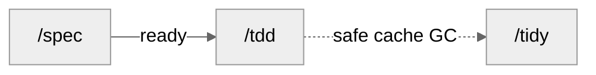

<div align="center">

# CosmosSkills

[GitHub](https://github.com/SilentUniverse/CosmosSkills) · [Issues](https://github.com/SilentUniverse/CosmosSkills/issues)

[](https://github.com/SilentUniverse/CosmosSkills/stargazers)
[](https://github.com/SilentUniverse/CosmosSkills/commits/main)


A complete engineering methodology for your coding agent — nine laws, an artifact gate, opt-in behavior evals, zero zombie states.

</div>

***

## 这是什么

CosmosSkills 是一套给单人开发者的 AI 编程工程方法论：28 个跨宿主技能、九条设计定律、一道工件门和一套按需行为 eval。它假设 AI 每次进场都从零开始，不信任 AI 的自我汇报——定律给方向，机器与可重放证据给结论。所有权衡按字典序处理：产品质量与正确性 > 交付速度 > Token 消耗；后两项不得削弱前一项的证据、安全或可访问性。

- **九条定律**：从 Hoare、Dijkstra、Parnas、Ousterhout 等软件工程经典提炼的九个问题。不给规范，让 AI 自己推导出好代码
- **机器门**：`verify-artifacts.py` 校验每份工件——完成记录点名的测试文件必须真实存在于磁盘，误删当场红灯；依赖图有环、PRD 版本链多头或缺头、需求记录源哈希漂移都会红灯
- **闭环工作流**：`/spec` 只在真实决策未定时问人，准备验证环境并产出可执行契约 → `/tdd` 实现和举证 → 双轴审查 + 一屏报告；`/tidy` 只清安全缓存
- **按需行为 eval**：默认关闭；项目内保留 previous / candidate / no-skill 配对实验，跨项目则导出同一份独立公开考卷，比较 Verified Success、速度、同口径成本与交接摩擦
- **单人本地优先**：本地 markdown 队列（ready | done 两态），零外部服务；中文沟通、沿用代码术语；面向人的输出以结果、证据和待决定事项为主

完整背景故事与设计出处见 [中文版](docs/introduction.zh.md) · [English](docs/introduction.en.md)。

## 九条定律

SOLID、Clean Code 是下游经验——告诉 AI 该写成什么样，规则一多就记不住。这九条是上游定律——每个词一个问题，让 AI 自己推导；每条在工作流里都有一个指定执行点，强制力分三级——机器红灯、流程必经、自审判据。

| # | 定律 | 它问的一句话 | 在哪被执行 |
|---|---|---|---|
| 1 | First Principles | 为什么？ | `/grill` 从根本推导，不接受类比 |
| 2 | Invariant | 什么必须永远为真？ | PRD 实现决策先写不变量；AC 从不变量推导 |
| 3 | Parsimony | 还能删掉什么？ | 选型阶梯逐级下行；对抗自审问「想象未来的抽象」；spec §3 计划时对每个抽象点名消费者；完成时删除无消费者的新增，深审 `/atk` |
| 4 | Locality | 影响能否限制在这里？ | 切卡算推理半径；两轴测试进 `CODEBASE.md` |
| 5 | Provability | 为什么确信它对？ | 等价设计选正确性论证更短者 |
| 6 | Adversarial Review | 怎么把它打爆？ | 高风险 spec 收尾 `/atk`；完成记录必填审查 |
| 7 | Empiricism | 现实数据怎么说？ | 观测压倒推理；性能主张必须带测量 |
| 8 | Reversibility | 错了能回来吗？ | 单向门单独标出吃最重审查；`PRD-v2` 对账 |
| 9 | Evolution | 最小正确下一步是什么？ | 首卡 = 最小可工作核心；宽重构 expand→contract |

---

## 三十秒装上

Windows，clone 完双击 `install.cmd`。

```bash
git clone https://github.com/SilentUniverse/CosmosSkills
```

macOS / Linux。

```bash
git clone https://github.com/SilentUniverse/CosmosSkills
cd CosmosSkills
bash scripts/install.sh
```

装完新开会话，敲 `/` 可检查技能发现情况。只想试试全局规则，不装技能，拉一份 CLAUDE.md 也行。

```bash
curl -fsSL https://raw.githubusercontent.com/SilentUniverse/CosmosSkills/main/claude/CLAUDE.md -o ~/.claude/CLAUDE.md
```

Codex 在本仓库通过根 [AGENTS.md](AGENTS.md) 读取共享策略 [CLAUDE.md](claude/CLAUDE.md)，避免维护两份正文。
安装器分发 Claude Code/ZCode 配置及已有 `~/.agents/skills`；不会修改全局 `~/.codex/AGENTS.md`。
显式指定安装目标或 ClaudeRoot 时，不镜像到用户级 ZCode / agents 目录；隔离安装需同时指定这两个路径。
在其他 Codex 项目使用这套常驻策略时，将共享文件的实际路径加入相应 AGENTS.md，并保留原有项目规则。

新项目直接用 `/spec` 起步即可。`.scratch/` 本地 issue、两态词汇和 `CODEBASE.md`
验证命令区懒出生都是默认约定，无需 setup。`/cosmos-setup` 只处理偏离：非默认
tracker/路径、遗留状态、旧 `docs/agents/domain.md` 折叠。

---

## 工作流



| | 做什么 |
|---|---|
| `/spec` | 固定意图与证据，准备验证环境，落档拆 issue。不写产品代码 |
| `/atk` | 对抗审查。新 public seam、单向门、耦合切片或证据不稳时由 spec 调用；手动敲默认有逐条讲解，`-r` 只报发现且不改文件 |
| `/tdd` | 红绿，写代码 |
| `/tidy` | 查询派生状态，清理已关闭批次的显式缓存；不搬 issue / test |
| `/eval` | 手动打开项目内 A/B 或跨项目 portable campaign；平时关闭 |

详细执行规则以各技能为准，入口不重复维护第二套流程：

- [spec](workflow/spec/SKILL.md)：明确结果、依赖和证据。多切片或跨会话工作才写可独立执行的卡；共享决策需要长期维护时才写 PRD。
- [tdd](workflow/tdd/SKILL.md)：按行为红绿验证；小而明确的需求可直接执行。复杂需求先在同一任务中规划，随后继续实现。
- [atk](workflow/atk/SKILL.md)：检查承重规则与失败方式；无发现也可通过，不为凑报告制造问题。
- [tidy](workflow/tidy/SKILL.md)：查询交付状态，清理已关闭批次的显式缓存。

技能是阶段工具。要求“实现并验证”时，规划、审查结束后继续工作；明确只要规划或审阅时，完成该范围即可。已授权提交则验证后进入 `/commit`，无需再发一次命令。

澄清只针对证据仍无法解决、会改变结果的决定。已提供的选择跨阶段保留；一个决定得到回答后，不追加“请回复对齐”。外部发布等行动若仍缺授权，先完成已有授权的准备，再展示可审阅结果。等待期间继续独立工作。

| 情形 | 执行方式 |
|---|---|
| 清晰的文案、配置或局部修复 | 直接修改，用相关现有检查验证；不强制 PRD、卡片、新测试 |
| 多个可独立交付的行为 | 按结果、证据和依赖拆卡；共享验证配置才提取 profile |
| 用户已指定公共接口变化 | 检查兼容性并实施；仅新出现的实质选择需要询问 |
| 真实权限、成本或产品选择缺失 | 提出具体问题，保留已决定部分，继续不受影响的工作 |
| 活跃批次的集成检查失败 | 保留证据，将相关卡退回 ready 修复；已交付历史行为变化另建 redo |
| 工具、子代理或会话轮换不可用 | 使用能力等价的可用路径；无法替代的验证明确报告，不能伪报通过 |

`ready` 仍要求真实的验证器预检。测试仍证明可观察行为；需要的集成检查、公共契约和已启用的 UI 证据门不会因模型更强而取消。

---

## 设计哲学

**上下文按需加载。** `SKILL.md` 保留共同路径；互斥或低频分支在决策点直接链接到 references/scripts/assets。约 100 行只触发披露复查，不是机械拆分门槛。先读任务点名文件、卡片或地图入口，发现依赖再展开；保留精简证据。只在真实会话边界交接，不按卡片数量强制换会话。

**深模块：接口留给品味，实现交给 AI。** 大量行为收进一个小接口，测试锁死接口行为——实现随便 AI 怎么写，红灯会说话。接口在文件置顶（类型先行，实现后看）；目录结构就是模块地图，地图和目录对不上，本身就是架构问题。

**人是裁决者，不是流水线工人。** AI 自己解决可查事实和有确定验证器的局部决策；只有结果会分叉时才问人。人读的是一屏决策面：目标、反例、公共边界、证据与待裁决；AI 读的是卡、路径、命令、摘要和机器收据。给人的文本优先可判断性，给 AI 的文本优先精确、短、低 token。默认不写解释型代码注释，只保留代码无法表达的契约、why 和外部约束。

**全集必清零。** 任何"全部 / 所有 / 逐个"任务，先用工具枚举全集（rg / rg --files / git diff），绝不凭记忆；每项要么完成、要么写明不动的原因；收尾重跑枚举命令检查未处理项，报告覆盖 N/N 及未解决项。每个结论带 file:line 或命令输出作证据。

**只并行真正独立的工作。** 默认 inline。`/tdd -p` 只并行写集和运行资源不冲突的卡；独立盲审保留独立上下文；大量多源研究必须有窄输出且主线程仍有可做工作。单文件、单次搜索、慢命令、大输出、顺序依赖和上下文清理都不是委派理由。全量 suite 由当前会话启动 supervisor；Standards / Spec 独立审查仍可并行。

28 个技能、工件门、按需行为 eval、九个词——目标是**先保证可逐条审查的产品质量，再缩短交付时间，最后降低 Token 消耗**；是否做到由 [evals](evals/README.md) 的真实对照结果回答，不由 README 宣称。

### 读写控制面

| 面向谁 | 必读 | 必写 | 禁止默认生成 |
|---|---|---|---|
| 人 | 真实决策前沿、公共契约、证据摘要、待裁决项 | 一次集中选择或授权 | 已确定需求的复述、实现流水账、机器分类号 |
| AI | resident `AGENTS.md` / `CLAUDE.md`、当前任务或卡、点名路径、验证命令；续跑再读 handoff `Continue` | 源文件、必要时的 issue/PRD、执行证据、必要不变量 | 全仓扫描、重复 SUMMARY、长日志入上下文 |
| 代码维护者 | 接口、测试、代码无法表达的 why/约束 | 语义必要注释 | 翻译代码、改动叙述、教程、装饰分隔注释 |

派生状态统一走 `workflow-state.py inspect`；测试输出统一走 supervisor；跨 session 状态统一走带 worktree digest 的 handoff（capsule 三型：active-work / awaiting-alignment / external-pending，resume 按型路由）。三者都让上下文只接收摘要，同时保留可回放原始证据。

---


## 怎么用

| 场景 | 敲 |
|---|---|
| 新需求 / 改已有需求 | `/spec <需求>` |
| 做一条 issue | `/tdd <path>` |
| 排空一个 feature 的 ready | `/tdd <feat>` |
| 全量测试与构建 | `/tdd -all` |
| 车机 / 设备，验收在 log 里 | `/tdd -log` |
| 过夜无人值守跑批 | 双击仓库根的 [overnight.cmd](overnight.cmd)（会问项目路径；给它建个桌面快捷方式最省事，也可把项目文件夹拖上去）；终端 `overnight.cmd [repo] [feat]`；macOS / Linux：`python scripts/overnight.py` |
| 上一 session 留了 handoff | `/resume` |
| 做到哪了 | `python3 <skills-root>/workflow-state.py survey . --format human`（默认只看 ready/blocked/zombie；`--history` 才列已交付历史） |
| 想听 AI 逐条讲它改了什么 | `/atk`（默认讲上一轮增量；`-all` 讲全部未提交） |
| 只要对抗审查，不允许改文件 | `/atk -r <目标>`（可省略目标，或用 `-all`） |
| 快速检查 workflow 改动 | `/eval smoke <skill>`（筛回归，不能声称更好） |
| 上游前证明 workflow 改进 | `/eval full <skill>`（3–5 次配对，默认平时不跑） |
| 与原生方案或其他 harness 比较 | `/eval export <campaign>`（各边独立跑同一公开包，私有盲判后 N 路报告） |
| 文档 / 技能文件改完 | `/lint <文件>` 查视角泄漏 |
| 接近真实会话边界 | 按 [PHASE-BOUNDARIES.md](claude/PHASE-BOUNDARIES.md) 选择继续或桥接，不按固定轮数压缩 |

能传路径就别让 agent 扫仓库。别把 PRD / issue 粘进对话。

### 改已有功能

`/spec "给订单加部分退款"` 会先做**影响面探测**：`rg` / `ast-grep` 查引用；小半径一行带过；真耦合才出报告（模块、可能回归的行为、哪些测试预期要改）。宽重构 expand → contract。grep 看不见的 invariant 落该区 `CODEBASE.md` 块。Python 等动态语言会标明静态查不全。命令：[impact-detection.md](workflow/spec/impact-detection.md)。

| issue | |
|---|---|
| `ready` | 直接改 / 加 / 删文件 |
| `done` | 不可改。`/spec` 出 redo → `/tdd` |

架构整体反转：先 `/grill` 写新 ADR。

### 切 session

| | |
|---|---|
| 仍能在当前上下文完成当前片段 | 继续，不为固定轮数压缩 |
| 未完成工作必须跨会话 | `/handoff` + `/clear` |
| 读大文件 / 陌生模块 | 先 `rg` 定位并按需读；只有大量独立研究才用 subagent |
| 做一半换任务 | `/handoff` → `/clear` → 新 session |

`/resume` 一次定位最近 active handoff，同时校验 `git_base` 与 `worktree_digest`，再按 `Continue` 的 READ/RUN/CONFIRM 续跑；桥接目标完成后删除。一份 handoff 一次消费。已完整结束就不写 handoff。

### 状态

| | |
|---|---|
| `ready` | 已对齐，逐条证据与验证环境都预检通过，可派发 |
| `done` | 不可改。返工新建 redo |

人手验证（品味、外部账号、人眼）记在 PRD 端到端验证；无 PRD 时记在 issue 的手动验证区。车机 / 设备走 `/tdd -log`。没有 inbox / blocked / shelved。

```bash
rg '^status: ready' -g '**/issues/*.md' .scratch
```

单字段：`yq --front-matter=extract '.status' <file>`。当前交付面：`python3 <skills-root>/workflow-state.py inspect <repo> <feat> --format human`。`SUMMARY.md` 与 `issues/archive/` 仅作为遗留迁移输入。

---

## 接入一个项目（跑一次）

**从 0 到 1** — 零 setup，默认约定直接生效。

1. 直接 `/spec` 起步；复用项目已有验证命令，只有不能从配置轻易找回的可复用适配器才写入 `CODEBASE.md` 的 `## Verifier commands` 区
2. 领域重的项目再 `/domain-modeling` 出术语表（CONTEXT.md）
3. 护栏按需：[shell-guardrails](tooling/shell-guardrails/SKILL.md) 选择合并、禁 push 或仅 modern CLI 策略；提交门用 [setup-pre-commit](tooling/setup-pre-commit/SKILL.md)

**接收已有项目** — 导航噪声真实存在时才建地图。

1. 术语或导航已经造成障碍时，用 `/domain-modeling` / `/map` 补足相关区域；不为新会话例行建图。不变量由 `/spec`、`/tdd` 在发现时事件驱动落盘。临时看懂某一块：`/show <path>`，一屏即弃
2. `/cosmos-setup` 只处理偏离：旧状态机、非默认路径、旧 `Status:` 行、旧 `docs/agents/domain.md` 折叠；对既有 `AGENTS.md` 只增不删
3. 护栏同上

### 文档放哪

| | 位置 | 放什么 |
|---|---|---|
| 项目级 | 仓库根 | `CONTEXT.md` 术语、`CODEBASE.md` 结构地图 |
| 长期 | `docs/` | `docs/adr/`（命令缓存在 CODEBASE.md 的 Verifier commands 区；`docs/agents/` 仅非默认 tracker 存在） |
| 工作态 | `.scratch/<feat>/` | `PRD.md`、`issues/`、按需 `handoff.md`（`tmp/` 被 ignore；不新建 `SUMMARY.md`） |
| 方法评测 | skills 仓库 `evals/` | 真实 regression/capability/routing case、rubric、calibration；runner 结果按 revision 另存 |

完整目录契约（一棵树 + 命名规则）：[ARTIFACT-FORMAT.md](workflow/ARTIFACT-FORMAT.md)。

`CONTEXT.md` 只写概念，一两句，不带路径、不带实现：

```markdown
## Account（账户）
持有余额的实体。
_Avoid_: Wallet, balance-holder
```

`CODEBASE.md` 双区：`## Verifier commands` 手维护区（测试/构建/性能命令缓存，懒出生，`/map` 再生与门禁都不动它）+ 生成区。生成区包含综合段（≤5 句）、非显然路由和分区 roster（一行一区、≤10 词，索引豁免两轴法）。正文 ≤40 行。细节在 `src/<area>/CLAUDE.md` 生成块（≤8 行）。事实行：`rg` 不出来 **且** 缺了会咬人。

```markdown
<!-- BEGIN GENERATED codebase (/map) -->
git_base: 7af387c
- 余额扣减必须查 frozen 标志，真入口是 `withdraw`（`_debit` 是私有的）
<!-- END GENERATED codebase -->
```

### 不要破坏

1. `done` 不可改 → 新建 `NN-redo-X.md`（唯一例外：`test_paths` 绿灯同步，仅 frontmatter 字段）
2. 推翻已记录的 AC/决策 → `PRD-v2.md`，旧的不动；纯增量 → detail / 改 `ready`，不动 PRD
3. AC 只写本切片新行为；前置靠 `blocked_by`。tdd 跑前会跳过已覆盖的 AC

---

## 低频

**ADR** 只在两处提议：`/grill`（三条标准见 `workflow/domain-modeling/ADR-FORMAT.md`）；`/improve-arch`（你否决一个重构且理由有分量）。`CONTEXT.md` 记是什么，`CODEBASE.md` 记 grep 拿不到的 + 怎么验证，`docs/adr/` 记为什么。

**少烧 token**

1. `CLAUDE.md` / `SKILL.md` 保持稳定
2. 未知结构的大文档先搜索定位；选中的指令文件完整读一次，其他材料只读命中段；跨 session 才 handoff，大量独立研究才 subagent
3. 别把 PRD / issue 粘进对话
4. 整文件读优于多次摸索
5. 稳定的验证适配器缓存在 `CODEBASE.md` 的 `## Verifier commands` 区；每张卡只记录这次真实 P# 结果和环境指纹，执行时用重放发现漂移

会话边界顺序：Continue → `/clear` → `/handoff` → `/compact`（[PHASE-BOUNDARIES.md](claude/PHASE-BOUNDARIES.md)）。subagent 只解决独立并行工作，不参与上下文清理。开机加载写在全局 CLAUDE.md §6。

**栈** — 测试命令、ADB、影响面探测都是 `CODEBASE.md` 单一 `## Verifier commands` 区里的行，不开新区段：

```markdown
## Verifier commands
- Full suite + build: `npm run test && npm run build`
- Scoped test: `pytest <path>::<test>`
- Impact 受影响代码：`pyright-impact.py capture/diff`（只看新增诊断）+ `rg '\bSYM\b'`
- Impact 受影响测试：`pytest --testmon`
```

常用类目：全量套件+构建、scoped 测试、静态门禁、性能、模块边界、证据留存、影响面探测；没用到的省略。

其他语言：[impact-detection.md](workflow/spec/impact-detection.md)。

---

## skill

源码只分两层：[workflow](workflow/README.md) 放产品与开发工作流，[tooling](tooling/README.md) 放安装、迁移和宿主工具。

| | 何时用 |
|---|---|
| [cosmos-setup](workflow/cosmos-setup/SKILL.md) | 偏离处理：非默认 tracker/路径、遗留状态迁移、domain.md 折叠、schema 升级 |
| [grill](workflow/grill/SKILL.md) | 拷问方案并维护已有领域记录。[domain-modeling](workflow/domain-modeling/SKILL.md) |
| [prototype](workflow/prototype/SKILL.md) | `/spec` 前造一次性原型 |
| [spec](workflow/spec/SKILL.md) | 规划并跑通验证环境预检，再写 PRD / issue |
| [eval](workflow/eval/SKILL.md) | 手动打开评测；保留项目内 previous/candidate A/B，也可导出独立包与任意外部 workflow 比较；默认关闭 |
| [atk](workflow/atk/SKILL.md) | 对抗审查自己的产出；工作流只调审查方向，手动默认讲解，`-r` 纯审查且不改文件 |
| [tdd](workflow/tdd/SKILL.md) | 写代码；`-all` 跑全量，`-log` 读设备 log。[DRAIN.md](workflow/tdd/DRAIN.md) |
| [commit](workflow/commit/SKILL.md) | 只提交本任务已验证路径并落地；`-local` 仅建本地提交 |
| [tidy](workflow/tidy/SKILL.md) | 派生状态查询 + 已关闭批次安全缓存 GC；不搬 issue / test |
| [diagnose](workflow/diagnose/SKILL.md) | 硬 bug / 性能回归 |
| [conflicts](workflow/conflicts/SKILL.md) | 解决 Git merge / rebase 冲突 |
| [map](workflow/map/SKILL.md) | 生成/刷新 `CODEBASE.md` 结构地图 |
| [show](workflow/show/SKILL.md) | 讲解陌生代码区：一屏（目的/模块图/一条流/先读什么）；`-html` 出给人看的单页 |
| [lint](workflow/lint/SKILL.md) | 视角审查：这句话离开写它的会话还成立吗 |
| [write-skill](workflow/write-skill/SKILL.md) | 写 / 改技能；确定性检查常跑，行为 eval 仅在手动 `/eval` 后运行 |
| [record-gif](workflow/record-gif/SKILL.md) | UI 录成验证过的 GIF |
| [research](workflow/research/SKILL.md) | 后台调研 |
| [improve-arch](workflow/improve-arch/SKILL.md) | 架构回顾。[codebase-design](workflow/codebase-design/SKILL.md) |

**引擎**（也可单独喊）

| | 承载 | 单独喊 |
|---|---|---|
| [domain-modeling](workflow/domain-modeling/SKILL.md) | 术语 / ADR | 只补表或一条 ADR |
| [codebase-design](workflow/codebase-design/SKILL.md) | deep-module 词汇 | 设计单个模块接口 |
| [code-review](workflow/code-review/SKILL.md) | Standards + Spec | 评 diff / 分支 / PR |

**其他：** [handoff](workflow/handoff/SKILL.md) · [resume](workflow/resume/SKILL.md) · [brief](workflow/brief/SKILL.md) · [teach](workflow/teach/SKILL.md)

**一次性：** [shell-guardrails](tooling/shell-guardrails/SKILL.md) · [setup-pre-commit](tooling/setup-pre-commit/SKILL.md) · [migrate-to-shoehorn](tooling/migrate-to-shoehorn/SKILL.md)（仅 TS）

名称迁移只有两项公共命令：`merge-conflicts` → `/conflicts`，`caveman` → `/brief`。
内部 `grilling` 已并入 `/grill`；两套单项 hook 技能已并入 `/shell-guardrails` 的按需分支。
`atk / map / eval / commit / handoff / resume / show / lint / tidy / improve-arch` 保持不变。
拉取名称或目录迁移后重跑 [Windows](install.cmd) 或 [Linux/macOS](scripts/install.sh) 安装器；它会创建当前链接，并只清理指向本仓库的退役 skill 链接。

---

## 维护

| | |
|---|---|
| 改完 CLAUDE.md / references / hooks | Windows 再双击 `install.cmd` |
| 全局规则源 | 只改 [`claude/CLAUDE.md`](claude/CLAUDE.md)；安装器复制到 Claude / ZCode 目标 |
| 改 skill | 改仓库即可（junction）；先跑 `python3 scripts/validate-skills.py`，想验证或上游前手动 `/eval`，再做 previous RED → candidate GREEN → 全回归 |
| 加 / 改 / 退役流程规则 | 先登记 [RULE-LEDGER.md](workflow/RULE-LEDGER.md)（防什么失败 · 出处 · 探针）；需要测量模型代际差异时，显式 `/eval full` 跑对应探针；普通规则修复先做确定性检查 |
| SKILL.md | 按 [write-skill](workflow/write-skill/SKILL.md) 做披露测试；行数只提示复查，不是拆分门槛；最终范围跑一次 `/atk` + `/lint` + `wc -l`，行为 eval 仅显式开启 |
| 改 hook | 先跑 `test-block-legacy-cli.ps1` / `test-block-dangerous-git.ps1` |
| 改 verify-artifacts | 跨平台先跑 `python3 -m unittest discover -s tests -v`；Windows 再跑 `test-verify-codebase.ps1` 全集 |
| 跑大测试 | 用 `tdd/scripts/test-supervisor.py` 指定 scope、timeout、log、receipt；不要因慢而委派 |
| 改 eval 协议 | `python3 scripts/eval.py validate-cases evals/cases` + `python3 scripts/eval_campaign.py --help` + `python3 -m unittest discover -s tests -v` |
| 契约 | [ARTIFACT-FORMAT.md](workflow/ARTIFACT-FORMAT.md) |

每个文件有读者；每个状态有闭环；每个入口有守门。
