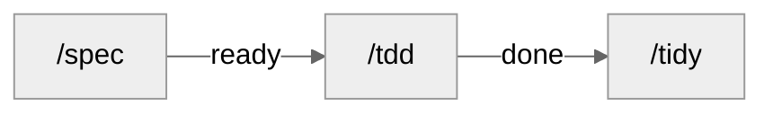

<div align="center">

# CosmosSkills

[GitHub](https://github.com/SilentUniverse/CosmosSkills) · [Issues](https://github.com/SilentUniverse/CosmosSkills/issues)

[](https://github.com/SilentUniverse/CosmosSkills/stargazers)
[](https://github.com/SilentUniverse/CosmosSkills/commits/main)


</div>

***

这套工作流，是从一个问题长出来的。

我当时写代码，一直靠两个心法撑着，第一性原理，还有对抗性审查。

有天我突发奇想，问 AI，人类几千年攒下来的思想里，还有没有这种级别的好东西？查理芒格、图灵、冯诺依曼、Hoare、Dijkstra，把这一路大佬的东西都翻一遍，提炼成单个的关键词给我。

它翻了一大堆资料，最后给了我九个词。

1. First Principles，为什么？
2. Invariant，什么必须永远为真？
3. Parsimony，还能删掉什么？
4. Locality，影响能不能限制在这？
5. Provability，凭什么确信它对？
6. Adversarial Review，怎么把它打爆？
7. Empiricism，数据怎么说？
8. Reversibility，错了回得来吗？
9. Evolution，最小正确的下一步是什么？

前两个是我本来就有的。后面七个，个个像是从软件工程几十年的尸山血海里捞出来的，Ousterhout 的深模块、Parnas 的信息隐藏、Dijkstra 的正确性论证、Brooks 的偶然复杂度，全被压成了一个词一个问题。

我把这九个词塞进全局规则，效果是真的，代码质量肉眼可见地变好。

但用着用着，我发现一个问题。

词是好词，AI 会背，不会做。它嘴上挂着不变量优先，转头就交给你一个状态没写完的实现。我让 AI 审查它自己改过的 27 个文件，它说全审完了，我拿工具一复查，15 个子文件它压根没打开过。

叮嘱是有天花板的，听不听，全凭它自觉。

所以才有 CosmosSkills。

它的底子不是我凭空造的，方法论的原型借鉴自 mattpocock 的 skills，那套东西是真好。但也真不合身，它是为多人协作造的，深度长在 GitHub 上，全英文世界。而我是一个人干活，纯本地，中文。

不合身的地方，我全重新裁过。协作机制整个拆掉，issue 变成本地 markdown 队列，只有 ready 和 done 两态，不依赖任何外部服务。语言立了双语规矩，思考和代码用英文，对话全中文。AI 说话人听不懂这件事，我磨得最久，最后的解法是条死规矩，给人看的东西永远是固定四件套，位置、原句、问题、处置，一句一行，机器读数永远不出现。

这些规矩最后都住进一个叫 CLAUDE.md 的文件，整套系统的宪法。这个文件我改了不知道多少版，标准就一条，每个词都得挣得走自己的位置，一句废话都塞不进去。包括 Windows 那些坑，PowerShell 写文件会悄悄毁掉中文内容，控制台默认 GBK 编码，删目录前必须用 cmd 看真实文件列表，这些全是我一个坑一个坑踩出来，再亲手钉进去的。现在它常驻一千三百词以内，超一个词，就得先删一句旧的。

定律给方向，机器给证据，AI 说自己照做了不算数，门查过才算数。这条主线从 mattpocock 那里继承过来，一直没变。变的是，它终于合身了。

**那道门长什么样。**

装完就有一个叫 verify-artifacts.py 的脚本守在那里。AI 说需求做完了？门会去查，完成记录里点名的每一个测试文件，必须真实存在于磁盘上，偷偷删了测试再报全绿，提交前就红灯。依赖图有环、frontmatter 缺字段、需求变更想悄悄改文件，门都不认。

**然后是失忆这件事。**

AI 每次进场都是新的，没有记忆，看不见你脑子里的地图。这套系统干脆假设每个会话从零开始。每张任务卡自足，只看一张卡就能开工。收工留一份 handoff，下一个会话读完就删，没有僵尸文件。你睡一觉，overnight.py 换着新会话把活跑完，早上起来看一屏报告，每项人工验证都带着可以直接粘贴的命令。

老祖宗没有文字的时候结绳记事。现在，轮到给失忆的 AI 结绳了。

说真的，用顺了之后最大的感受不是快，是敢。敢把一整晚的活交给它，因为知道机器门在，知道每个结论都带着出处，知道哪怕十件事只做完了九件，少的那一件，它也得写清楚为什么。

这套东西我自己天天在用。上手不难，装完记住三条命令就够了，/spec 拆卡，/tdd 写码，/atk 审查。真正要适应的不是工具，是把原来散着干的活，交给流程管。交出去之后，就回不去了。

最后说说这个名字。

太阳系有九颗行星，冥王星被开除前，教科书上写的就是九大行星。这套系统里刚好九条定律，围着你的代码转。

而我，网名一直叫静默宇宙。

九条定律，九颗行星，静默宇宙。

所以是，CosmosSkills，enjoy。

---

## 三十秒装上

Windows，clone 完双击 `install.cmd`。

```bash
git clone https://github.com/SilentUniverse/CosmosSkills
```

macOS / Linux。

```bash
git clone https://github.com/SilentUniverse/CosmosSkills
cd CosmosSkills
bash scripts/install.sh
```

装完新开会话，敲 `/` 能看到 27 个技能就成功了。只想试试全局规则，不装技能，拉一份 CLAUDE.md 也行。

```bash
curl -fsSL https://raw.githubusercontent.com/SilentUniverse/CosmosSkills/main/claude/CLAUDE.md -o ~/.claude/CLAUDE.md
```

新项目第一次用，跑一次 `/cosmos-setup`，它会问你三个问题然后把目录约定都建好。

---

## 工作流



| | 做什么 |
|---|---|
| `/spec` | 落档、拆 issue。不写代码 |
| `/atk` | 对抗审查。spec 收尾自动跑；手动敲另有逐条讲解 |
| `/tdd` | 红绿，写代码 |
| `/tidy` | 归档 `done`，重生成 `SUMMARY.md` |

**/spec**

- 小而清晰：跳过 PRD 直拆（`## 上级` 自带上下文）
- 会改卡的决定才问；ADR 级 → `/grill`；外部事实不问你——同轮 fan out 给后台 research（上限 3）
- 已有功能：没推翻已记录的 AC/决策 → detail / 改 `ready`；推翻了 → `PRD-v2` + 对账；跨特性先问一句
- 已有代码：影响面探测
- 写不出自足卡（`## 做什么` + AC）就不是独立 issue；AC 从不变量推导，穿过点名的接缝跑
- 并行批次同时声明写集（`touches` + `test_paths`，`-p` 波次的唯一撞车信号；`--log` 卡不声明）；UI 卡先拆三层——逻辑与结构进 AC，纯视觉进端到端验证
- agent 跑不了的验证 → PRD 端到端验证
- 有真设计权衡 → 先 `/prototype`
- 实现决策先写不变量；单向门（ABI / schema / 协议）单独标出吃最重审查
- 收尾冷读每张卡；写了 PRD 或 ≥5 张卡 → 自动 `/atk` 审查，发现进待决
- PRD 是意图快照，推翻已记录的 AC/决策才写新版本；防漏靠切片 quiz 和 AC，不是 PRD

**/atk**

- spec 收尾自动调（写了 PRD 或 ≥5 张卡）——审查态，只产发现：能推翻卡片的进待决，其余当场修
- 手动 `/atk` ——审查 + 逐条讲解，一条改动两行（改了什么 / 为什么）；默认讲上一轮增量，`--all` 讲全部未提交
- 攻法正反两向：正向以使用者身份走每条入口→指针→链路；反向对前身逐条对账——旧版每条规则仍是"仍在 / 已迁移且可达 / 有理由删除"三态之一

**/tdd**

- 一条 / 裸跑排空 / `<feat>` 串行；`-p` 并行（声明撞车的卡自动串行；worktree 仅用户显式要求）
- `--log`：车机 / 设备，验收是命令的 log 文件
- 人验在 PRD 端到端验证；批末全量 suite + build + 双轴审查 + 一屏五块报告；done 攒够 → `/tidy`

**/tidy**

- `done` 进 `issues/archive/`（不改 body）
- 重生成 `SUMMARY.md`
- 审计僵尸 / 重复测试 + 孤儿 issue

需求又变 → 再 `/spec`。只加一块 → detail。重大方向反转先 `/grill` 写新 ADR，旧的标 `Status: superseded`。`done` 不动，要改就 `NN-redo-X.md`。

全长链不是必经管道，见下面怎么喊。

---

**三个防漂移机制**（贯穿全流程）：
- **冷读** — spec 收尾把每张卡当一无所知的执行者重读；AC 跑不动、依赖没写清，当场打回
- **对账** — 需求推翻不是悄悄改文件：`PRD-v2` + 逐条对账报告（✓ 仍有效 / ⚠ 返工 / ✏ 改写 / 🗑 删除 / ➕ 新增）
- **闭环** — handoff 一份生产一次消费，`/resume` 完成即删；done 攒够 `/tidy` 归档；说不清的问题停在 PRD 雾区，不假装精确

---

## 设计哲学

**上下文是最贵的资源。** ~150k token 的 smart zone 是质量天花板，不是上下文上限。每个技能头 <100 行，细则拆成按需加载的子文件；切卡时计算**推理半径**——这张卡要读几个模块才能确信正确，半径就是它以后每一次执行的 token 成本；会话边界五问有序：Continue → `/clear` → `/handoff` → subagent → `/compact`，有损的压缩永远排最后。

**深模块：接口留给品味，实现交给 AI。** 大量行为收进一个小接口，测试锁死接口行为——实现随便 AI 怎么写，红灯会说话。接口在文件置顶（类型先行，实现后看）；目录结构就是模块地图，地图和目录对不上，本身就是架构问题。

**人是裁决者，不是流水线工人。** 关批报告一屏五块：结果计数、frontier（每张未完成卡一行：被谁阻塞）、待裁决、等你验证（每项带可直接粘贴的命令）、详文指针；PRD 定稿只审"测试决策 + 范围外 + AC 标题"——抓错最便宜的两处。`/atk` 双态：工作流里自动跑的只有**审查**（发现进待决），你手动敲 `/atk` 才有**逐条讲解**——每个改动是什么、为什么，一条一行，逐条裁决。所有给你看的发现都是固定形状——位置、原句、问题、处置，一句一行；探针模式、分类号这类机器读数永不出现。

**全集必清零。** 任何"全部 / 所有 / 逐个"任务，先用工具枚举全集（grep / ls / git diff），绝不凭记忆；每项要么完成、要么写明不动的原因；收尾重跑枚举命令验证残留为零，报告以 N/N 结束——每个结论带 file:line 或命令输出作证据。

**能并行的都在并行。** spec 定稿前，外部事实类问题同轮 fan out 给后台 research（上限 3）；`/tdd -p` 按依赖分波次并行（波内 ≤4），卡上声明的 `touches`/`test_paths` 撞车的自动串行成先后波、缺声明的单独成波，过夜由 [overnight.py](scripts/overnight.py) 逐波换新会话；关批时全量 suite、Standards 轴、Spec 轴三个只读子代理同轮齐发。

27 个技能、一道机器门、九个词——所有规则只为三件事：**更少的 token、更快的交付、可逐条审查的质量。**

---


## 怎么用

| 场景 | 敲 |
|---|---|
| 新需求 / 改已有需求 | `/spec <需求>` |
| 做一条 issue | `/tdd <path>` |
| 排空一个 feature 的 ready | `/tdd <feat>` |
| 车机 / 设备，验收在 log 里 | `/tdd --log` |
| 过夜无人值守跑批 | 双击仓库根的 [overnight.cmd](overnight.cmd)（会问项目路径；给它建个桌面快捷方式最省事，也可把项目文件夹拖上去）；终端 `overnight.cmd [repo] [feat]`；macOS / Linux：`python scripts/overnight.py` |
| 上一 session 留了 handoff | `/resume` |
| 做到哪了 | 自己跑 `rg '^status:' -g '**/issues/*.md' .scratch` |
| 想听 AI 逐条讲它改了什么 | `/atk`（默认讲上一轮增量；`--all` 讲全部未提交） |
| 文档 / 技能文件改完 | `/lint <文件>` 查视角泄漏 |
| 5 轮内能收尾 | `/compact`（grill→spec 之间禁止） |
| 还有半天 / 换任务 | `/handoff` + `/clear` |

能传路径就别让 agent 扫仓库。别把 PRD / issue 粘进对话。

### 改已有功能

`/spec "给订单加部分退款"` 会先做**影响面探测**：`rg` / `ast-grep` 查引用；小半径一行带过；真耦合才出报告（模块、可能回归的行为、哪些测试预期要改）。宽重构 expand → contract。grep 看不见的 invariant 落该区 `CODEBASE.md` 块。Python 等动态语言会标明静态查不全。命令：[impact-detection.md](engineering/spec/impact-detection.md)。

| issue | |
|---|---|
| `ready` | 直接改 / 加 / 删文件 |
| `done` | 不可改。`/spec` 出 redo → `/tdd` |

架构整体反转：先 `/grill` 写新 ADR。

### 切 session

| | |
|---|---|
| 5 轮内能收尾 | `/compact`（grill→spec 之间禁止） |
| 还有半天 | `/handoff` + `/clear` |
| 读大文件 / 陌生模块 | subagent，只回报结论 |
| 做一半换任务 | `/handoff` → `/clear` → 新 session |

`/resume` 找最近 `status: active` 的 handoff，对 `git_base`，按开机序列续，收尾**直接删除文件**——一份 handoff 一次消费，不堆积（git 留历史）。上一 session 已完整结束 → 不要写 handoff，直接 `/tdd` 下一条。长任务每天收工前一份；跨 session 的 epic 每次切换前一份。

### 状态

| | |
|---|---|
| `ready` | 写清楚了，可派发 |
| `done` | 不可改。返工新建 redo |

人手验证（品味、外部账号、人眼）记在 PRD 端到端验证。车机 / 设备走 `/tdd --log`。没有 inbox / blocked / shelved。

```bash
rg '^status: ready' -g '**/issues/*.md' .scratch
```

单字段：`yq --front-matter=extract '.status' <file>`。已建成 → `SUMMARY.md`。历史 → `issues/archive/`。

---

## 接入一个项目（跑一次）

**从 0 到 1**

1. `/cosmos-setup`（默认：本地 markdown / 两态 / 单 context）→ `docs/agents/` + `CLAUDE.md` 的 `## Agent skills`
2. `CONTEXT.md` + `CODEBASE.md`（见下）
3. 护栏按需：[git-guardrails](misc/git-guardrails-claude-code/SKILL.md)、[modern-cli-guardrails](misc/modern-cli-guardrails/SKILL.md)、[setup-pre-commit](misc/setup-pre-commit/SKILL.md)

**接收已有项目** — 先建地图，少让 agent 反复扫代码。

1. `/domain-modeling` 术语表 + `/zoom-out` 结构地图（都有 draft：一次起草、一次审）。临时看一块：`/zoom-out <path>`，默认只读
2. `/cosmos-setup` 识别旧状态机、非默认路径、旧 `Status:` 行，确认后落盘
3. 护栏同上

### 文档放哪

| | 位置 | 放什么 |
|---|---|---|
| 项目级 | 仓库根 | `CONTEXT.md` 术语、`CODEBASE.md` 结构地图 |
| 长期 | `docs/` | `docs/adr/`、`docs/agents/`（`domain.md` 缓存测试 / 构建 / 影响面 / 性能测量命令） |
| 工作态 | `.scratch/<feat>/` | `PRD.md`、`issues/`、`SUMMARY.md`、`handoff.md`（`tmp/` 被 ignore） |

完整目录契约（一棵树 + 命名规则）：[ARTIFACT-FORMAT.md](engineering/ARTIFACT-FORMAT.md)。

`CONTEXT.md` 只写概念，一两句，不带路径、不带实现：

```markdown
## Account（账户）
持有余额的实体。
_Avoid_: Wallet, balance-holder
```

`CODEBASE.md` root：综合段（≤5 句）+ 非显然路由 + 分区 roster（一行一区、≤10 词）。正文 ≤40 行。细节在 `src/<area>/CLAUDE.md` 生成块（≤8 行）。每行：`rg` 不出来 **且** 缺了会咬人。

```markdown
<!-- BEGIN GENERATED codebase (/zoom-out) -->
git_base: 7af387c
- 余额扣减必须查 frozen 标志，真入口是 `withdraw`（`_debit` 是私有的）
<!-- END GENERATED codebase -->
```

### 不要破坏

1. `done` 不可改 → 新建 `NN-redo-X.md`（唯一例外：`test_paths` 绿灯同步，仅 frontmatter 字段）
2. 推翻已记录的 AC/决策 → `PRD-v2.md`，旧的不动；纯增量 → detail / 改 `ready`，不动 PRD
3. AC 只写本切片新行为；前置靠 `blocked_by`。tdd 跑前会跳过已覆盖的 AC

---

## 低频

**ADR** 只在两处提议：`/grill`（三条标准见 `engineering/domain-modeling/ADR-FORMAT.md`）；`/improve-arch`（你否决一个重构且理由有分量）。`CONTEXT.md` 记是什么，`CODEBASE.md` 记 grep 拿不到的，`docs/adr/` 记为什么。

**少烧 token**

1. `CLAUDE.md` / `SKILL.md` 保持稳定
2. 大文档另开 session 或 subagent
3. 别把 PRD / issue 粘进对话
4. 整文件读优于多次摸索
5. 环境可查的（package.json scripts、目录树、`--help`）不写进文档——拷贝是会过期的缓存

会话边界顺序：Continue → `/clear` → `/handoff` → subagent → `/compact`（[PHASE-BOUNDARIES.md](claude/PHASE-BOUNDARIES.md)）。开机加载写在全局 CLAUDE.md §6。单 / 多 context 在 `docs/agents/domain.md`。

**栈** — 测试命令、ADB、影响面探测写进 `docs/agents/domain.md`：

```markdown
## 影响面探测命令（impact detection）
- 受影响代码：`pyright --outputjson` + `rg '\bSYM\b'`
- 受影响测试：`pytest --testmon`
- import 图：`grimp`
```

其他语言：[impact-detection.md](engineering/spec/impact-detection.md)。

---

## skill

| | 何时用 |
|---|---|
| [cosmos-setup](engineering/cosmos-setup/SKILL.md) | 项目首次接入；Case 5 迁 frontmatter |
| [grill](engineering/grill/SKILL.md) | 拷问方案。[grilling](productivity/grilling/SKILL.md) + [domain-modeling](engineering/domain-modeling/SKILL.md) |
| [prototype](engineering/prototype/SKILL.md) | `/spec` 前造一次性原型 |
| [spec](engineering/spec/SKILL.md) | 规划：只写 PRD / issue |
| [atk](engineering/atk/SKILL.md) | 对抗审查自己的产出；工作流只调审查方向，讲解仅手动触发 |
| [tdd](engineering/tdd/SKILL.md) | 写代码；`--log` 读设备 log。[DRAIN.md](engineering/tdd/DRAIN.md) |
| [tidy](engineering/tidy/SKILL.md) | 归档、SUMMARY、僵尸测试 |
| [diagnose](engineering/diagnose/SKILL.md) | 硬 bug / 性能回归 |
| [merge-conflicts](engineering/merge-conflicts/SKILL.md) | merge / rebase 冲突 |
| [zoom-out](engineering/zoom-out/SKILL.md) | 地图视角；可落盘 `CODEBASE.md` |
| [lint](engineering/lint/SKILL.md) | 视角审查：这句话离开写它的会话还成立吗 |
| [write-skill](productivity/write-skill/SKILL.md) | 写 / 改技能；改完验收三连 `/atk` + `/lint` + `wc -l` |
| [record-gif](engineering/record-gif/SKILL.md) | UI 录成验证过的 GIF |
| [research](engineering/research/SKILL.md) | 后台调研 |
| [improve-arch](engineering/improve-arch/SKILL.md) | 架构回顾。[codebase-design](engineering/codebase-design/SKILL.md) |

**引擎**（也可单独喊）

| | 承载 | 单独喊 |
|---|---|---|
| [grilling](productivity/grilling/SKILL.md) | 采访循环 | 临时想清楚一件事 |
| [domain-modeling](engineering/domain-modeling/SKILL.md) | 术语 / ADR | 只补表或一条 ADR |
| [codebase-design](engineering/codebase-design/SKILL.md) | deep-module 词汇 | 设计单个模块接口 |
| [code-review](engineering/code-review/SKILL.md) | Standards + Spec | 评 diff / 分支 / PR |

**其他：** [handoff](productivity/handoff/SKILL.md) · [resume](productivity/resume/SKILL.md) · [caveman](productivity/caveman/SKILL.md) · [teach](productivity/teach/SKILL.md)

**一次性：** [git-guardrails](misc/git-guardrails-claude-code/SKILL.md) · [modern-cli-guardrails](misc/modern-cli-guardrails/SKILL.md) · [setup-pre-commit](misc/setup-pre-commit/SKILL.md) · [migrate-to-shoehorn](misc/migrate-to-shoehorn/SKILL.md)（仅 TS）

---

## 维护

| | |
|---|---|
| 改完 CLAUDE.md / references / hooks | Windows 再双击 `install.cmd` |
| 改 skill | 改仓库即可（junction） |
| SKILL.md | <100 行；超了按 [write-skill](productivity/write-skill/SKILL.md) 拆；改完跑 `/atk` + `/lint` + `wc -l` |
| 改 hook | 先跑 `test-block-legacy-cli.ps1` / `test-block-dangerous-git.ps1` |
| 改 verify-artifacts | 跑 `test-verify-codebase.ps1` |
| 契约 | [ARTIFACT-FORMAT.md](engineering/ARTIFACT-FORMAT.md) |

每个文件有读者；每个状态有闭环；每个入口有守门。
