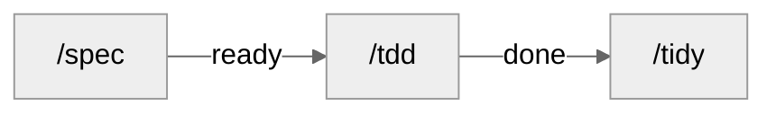

<div align="center">

# CosmosSkills

[GitHub](https://github.com/SilentUniverse/CosmosSkills) · [Issues](https://github.com/SilentUniverse/CosmosSkills/issues)

[](https://github.com/SilentUniverse/CosmosSkills/stargazers)
[](https://github.com/SilentUniverse/CosmosSkills/commits/main)


A complete engineering methodology for your coding agent — nine laws, an artifact gate, opt-in behavior evals, zero zombie states.

</div>

***

## 这是什么

CosmosSkills 是一套给单人开发者的 AI 编程工程方法论：29 个 Claude Code 技能、九条设计定律、一道工件门和一套按需行为 eval。它假设 AI 每次进场都从零开始，不信任 AI 的自我汇报——定律给方向，机器与可重放证据给结论。

- **九条定律**：从 Hoare、Dijkstra、Parnas、Ousterhout 等软件工程经典提炼的九个问题。不给规范，让 AI 自己推导出好代码
- **机器门**：`verify-artifacts.py` 校验每份工件——完成记录点名的测试文件必须真实存在于磁盘，误删当场红灯；依赖图有环、绕过对账的需求变更全部拦截
- **闭环工作流**：`/spec` 先准备环境、跑通验证器预检，再用设计回执对齐并拆卡 → `/tdd` 只需实现和举证 → 双轴审查 + 一屏报告 → `/tidy` 回收
- **按需行为 eval**：默认关闭；项目内保留 previous / candidate / no-skill 配对实验，跨项目则导出同一份独立公开考卷，比较 Verified Success、Success@Budget、速度、成本与交接摩擦
- **单人本地优先**：本地 markdown 队列（ready | done 两态），零外部服务；中文对话、英文思考与代码；面向人的输出固定四件套、一句一行

完整背景故事与设计出处见 [中文版](docs/introduction.zh.md) · [English](docs/introduction.en.md)

## 九条定律

SOLID、Clean Code 是下游经验——告诉 AI 该写成什么样，规则一多就记不住。这九条是上游定律——每个词一个问题，让 AI 自己推导；每条在工作流里都有会红灯的执行点。

| # | 定律 | 它问的一句话 | 在哪被执行 |
|---|---|---|---|
| 1 | First Principles | 为什么？ | `/grill` 从根本推导，不接受类比 |
| 2 | Invariant | 什么必须永远为真？ | PRD 实现决策先写不变量；AC 从不变量推导 |
| 3 | Parsimony | 还能删掉什么？ | 选型阶梯逐级下行；对抗自审问「想象未来的抽象」 |
| 4 | Locality | 影响能否限制在这里？ | 切卡算推理半径；两轴测试进 `CODEBASE.md` |
| 5 | Provability | 为什么确信它对？ | 等价设计选正确性论证更短者 |
| 6 | Adversarial Review | 怎么把它打爆？ | spec 收尾自动 `/atk`；完成记录必填审查 |
| 7 | Empiricism | 现实数据怎么说？ | 观测压倒推理；性能主张必须带测量 |
| 8 | Reversibility | 错了能回来吗？ | 单向门单独标出吃最重审查；`PRD-v2` 对账 |
| 9 | Evolution | 最小正确下一步是什么？ | 首卡 = 最小可工作核心；宽重构 expand→contract |

---

## 三十秒装上

Windows，clone 完双击 `install.cmd`。

```bash
git clone https://github.com/SilentUniverse/CosmosSkills
```

macOS / Linux。

```bash
git clone https://github.com/SilentUniverse/CosmosSkills
cd CosmosSkills
bash scripts/install.sh
```

装完新开会话，敲 `/` 能看到 29 个技能就成功了。只想试试全局规则，不装技能，拉一份 CLAUDE.md 也行。

```bash
curl -fsSL https://raw.githubusercontent.com/SilentUniverse/CosmosSkills/main/claude/CLAUDE.md -o ~/.claude/CLAUDE.md
```

新项目第一次用，跑一次 `/cosmos-setup`，它会问你三个问题然后把目录约定都建好。

---

## 工作流



| | 做什么 |
|---|---|
| `/spec` | 对齐目标，准备并预检验证环境，落档拆 issue。不写产品代码 |
| `/atk` | 对抗审查。spec 收尾自动跑；手动敲另有逐条讲解 |
| `/tdd` | 红绿，写代码 |
| `/tidy` | 归档 `done`，重生成 `SUMMARY.md` |
| `/eval` | 手动打开项目内 A/B 或跨项目 portable campaign；平时关闭 |

**/spec**

- 先按每类验证器实际运行 P# 预检：工作目录、runtime/tool、service、fixture、权限、网络和环境指纹都就绪；缺项不产 `ready`，`/tdd` 不负责临时安装
- 需求决策收敛后给**设计回执**：目标/反例、边界、不变量、接缝与流程、逐条 AC→证据→P#、切片 DAG；你明确回复“对齐”后才写 PRD/`ready` issue
- 小而清晰：跳过 PRD 直拆（`## 上级` 自带上下文）
- 会改卡的决定才问；ADR 级 → `/grill`；外部事实不问你——同轮 fan out 给后台 research（上限 3）
- 已有功能：没推翻已记录的 AC/决策 → detail / 改 `ready`；推翻了 → `PRD-v2` + 对账；跨特性先问一句
- 已有代码：影响面探测
- 写不出自足卡（`## 做什么` + AC + 每条 AC→证据→已通过 P#）就不是独立 issue；AC 从不变量推导，穿过点名的接缝跑
- 并行批次同时声明写集（`touches` + `test_paths`，`-p` 波次的唯一撞车信号；`--log` 卡不声明）；UI 卡先拆三层——逻辑与结构进 AC，纯视觉进端到端验证
- agent 能跑的浏览器/模拟器/CLI/trace 由 agent 自己执行并保留命令+观测+证据；只有品味、权限、不可访问账号等真·人验进 PRD 端到端验证
- 有真设计权衡 → 先 `/prototype`
- 实现决策先写不变量；单向门（ABI / schema / 协议）单独标出吃最重审查
- 收尾冷读每张卡；写了 PRD 或 ≥5 张卡 → 自动 `/atk` 审查，发现进待决
- PRD 是意图快照，推翻已记录的 AC/决策才写新版本；防漏靠设计回执的需求→证据→切片映射和 AC，不靠持续膨胀 PRD

**/atk**

- spec 收尾自动调（写了 PRD 或 ≥5 张卡）——审查态，只产发现：能推翻卡片的进待决，其余当场修
- 手动 `/atk` ——审查 + 逐条讲解，一条改动两行（改了什么 / 为什么）；默认讲上一轮增量，`--all` 讲全部未提交
- 攻法正反两向：正向以使用者身份走每条入口→指针→链路；反向对前身逐条对账——旧版每条规则仍是"仍在 / 已迁移且可达 / 有理由删除"三态之一

**/tdd**

- 一条 / 裸跑排空 / `<feat>` 串行；`-p` 并行（声明撞车的卡自动串行；worktree 仅用户显式要求）
- `--log`：车机 / 设备，验收是命令的 log 文件
- 人验在 PRD 端到端验证；批末全量 suite + build + 双轴审查 + 一屏五块报告；done 攒够 → `/tidy`

**/tidy**

- `done` 进 `issues/archive/`（不改 body）
- 重生成 `SUMMARY.md`
- 审计僵尸 / 重复测试 + 孤儿 issue

需求又变 → 再 `/spec`。只加一块 → detail。重大方向反转先 `/grill` 写新 ADR，旧的标 `Status: superseded`。`done` 不动，要改就 `NN-redo-X.md`。

全长链不是必经管道，见下面怎么喊。

---

**四个防漂移机制**（贯穿全流程）：
- **设计回执** — 落盘前让 agent 回放目标、反例、验证、已跑通的环境预检和切片；人的“对齐”是 ready 的授权
- **冷读** — spec 收尾把每张卡当一无所知的执行者重读；AC 跑不动、依赖没写清，当场打回
- **对账** — 需求推翻不是悄悄改文件：`PRD-v2` + 逐条对账报告（✓ 仍有效 / ⚠ 返工 / ✏ 改写 / 🗑 删除 / ➕ 新增）
- **闭环** — handoff 一份生产一次消费，`/resume` 完成即删；done 攒够 `/tidy` 归档；说不清的问题停在 PRD 雾区，不假装精确

---

## 设计哲学

**上下文是最贵的资源。** ~150k token 的 smart zone 是质量天花板，不是上下文上限。每个技能头 <100 行，细则拆成按需加载的子文件；切卡时计算**推理半径**——这张卡要读几个模块才能确信正确，半径就是它以后每一次执行的 token 成本；会话边界五问有序：Continue → `/clear` → `/handoff` → subagent → `/compact`，有损的压缩永远排最后。

**深模块：接口留给品味，实现交给 AI。** 大量行为收进一个小接口，测试锁死接口行为——实现随便 AI 怎么写，红灯会说话。接口在文件置顶（类型先行，实现后看）；目录结构就是模块地图，地图和目录对不上，本身就是架构问题。

**人是裁决者，不是流水线工人。** 最便宜的裁决点在代码前：设计回执把目标、反例、验证契约和切片 DAG 放在一屏里，多轮校正后才落盘。关批报告仍是一屏五块：结果计数与机器证据、frontier、待裁决、等你验证、详文指针。`/atk` 双态：工作流里自动跑的只有**审查**（发现进待决），你手动敲 `/atk` 才有**逐条讲解**——每个改动是什么、为什么，一条一行，逐条裁决。所有给你看的发现都是固定形状——位置、原句、问题、处置，一句一行；探针模式、分类号这类机器读数永不出现。

**全集必清零。** 任何"全部 / 所有 / 逐个"任务，先用工具枚举全集（grep / ls / git diff），绝不凭记忆；每项要么完成、要么写明不动的原因；收尾重跑枚举命令验证残留为零，报告以 N/N 结束——每个结论带 file:line 或命令输出作证据。

**能并行的都在并行。** spec 定稿前，外部事实类问题同轮 fan out 给后台 research（上限 3）；`/tdd -p` 按依赖分波次并行（波内 ≤4），卡上声明的 `touches`/`test_paths` 撞车的自动串行成先后波、缺声明的单独成波，过夜由 [overnight.py](scripts/overnight.py) 逐波换新会话；关批时全量 suite、Standards 轴、Spec 轴三个只读子代理同轮齐发。

29 个技能、工件门、按需行为 eval、九个词——目标仍是**更少的 token、更快的交付、可逐条审查的质量**；是否做到由 [evals](evals/README.md) 的真实对照结果回答，不由 README 宣称。

---


## 怎么用

| 场景 | 敲 |
|---|---|
| 新需求 / 改已有需求 | `/spec <需求>` |
| 做一条 issue | `/tdd <path>` |
| 排空一个 feature 的 ready | `/tdd <feat>` |
| 车机 / 设备，验收在 log 里 | `/tdd --log` |
| 过夜无人值守跑批 | 双击仓库根的 [overnight.cmd](overnight.cmd)（会问项目路径；给它建个桌面快捷方式最省事，也可把项目文件夹拖上去）；终端 `overnight.cmd [repo] [feat]`；macOS / Linux：`python scripts/overnight.py` |
| 上一 session 留了 handoff | `/resume` |
| 做到哪了 | 自己跑 `rg '^status:' -g '**/issues/*.md' .scratch` |
| 想听 AI 逐条讲它改了什么 | `/atk`（默认讲上一轮增量；`--all` 讲全部未提交） |
| 快速检查 workflow 改动 | `/eval smoke <skill>`（筛回归，不能声称更好） |
| 上游前证明 workflow 改进 | `/eval full <skill>`（3–5 次配对，默认平时不跑） |
| 与原生方案或其他 harness 比较 | `/eval export <campaign>`（各边独立跑同一公开包，私有盲判后 N 路报告） |
| 文档 / 技能文件改完 | `/lint <文件>` 查视角泄漏 |
| 5 轮内能收尾 | `/compact`（grill→spec 之间禁止） |
| 还有半天 / 换任务 | `/handoff` + `/clear` |

能传路径就别让 agent 扫仓库。别把 PRD / issue 粘进对话。

### 改已有功能

`/spec "给订单加部分退款"` 会先做**影响面探测**：`rg` / `ast-grep` 查引用；小半径一行带过；真耦合才出报告（模块、可能回归的行为、哪些测试预期要改）。宽重构 expand → contract。grep 看不见的 invariant 落该区 `CODEBASE.md` 块。Python 等动态语言会标明静态查不全。命令：[impact-detection.md](engineering/spec/impact-detection.md)。

| issue | |
|---|---|
| `ready` | 直接改 / 加 / 删文件 |
| `done` | 不可改。`/spec` 出 redo → `/tdd` |

架构整体反转：先 `/grill` 写新 ADR。

### 切 session

| | |
|---|---|
| 5 轮内能收尾 | `/compact`（grill→spec 之间禁止） |
| 还有半天 | `/handoff` + `/clear` |
| 读大文件 / 陌生模块 | subagent，只回报结论 |
| 做一半换任务 | `/handoff` → `/clear` → 新 session |

`/resume` 找最近 `status: active` 的 handoff，对 `git_base`，按开机序列续，收尾**直接删除文件**——一份 handoff 一次消费，不堆积（git 留历史）。上一 session 已完整结束 → 不要写 handoff，直接 `/tdd` 下一条。长任务每天收工前一份；跨 session 的 epic 每次切换前一份。

### 状态

| | |
|---|---|
| `ready` | 已对齐，逐条证据与验证环境都预检通过，可派发 |
| `done` | 不可改。返工新建 redo |

人手验证（品味、外部账号、人眼）记在 PRD 端到端验证。车机 / 设备走 `/tdd --log`。没有 inbox / blocked / shelved。

```bash
rg '^status: ready' -g '**/issues/*.md' .scratch
```

单字段：`yq --front-matter=extract '.status' <file>`。已建成 → `SUMMARY.md`。历史 → `issues/archive/`。

---

## 接入一个项目（跑一次）

**从 0 到 1**

1. `/cosmos-setup`（默认：本地 markdown / 两态 / 单 context）→ `docs/agents/` + `CLAUDE.md` 的 `## Agent skills`
2. `CONTEXT.md` + `CODEBASE.md`（见下）
3. 护栏按需：[git-guardrails](misc/git-guardrails-claude-code/SKILL.md)、[modern-cli-guardrails](misc/modern-cli-guardrails/SKILL.md)、[setup-pre-commit](misc/setup-pre-commit/SKILL.md)

**接收已有项目** — 先建地图，少让 agent 反复扫代码。

1. 先 `/domain-modeling` 出术语表（CONTEXT.md），再 `/map` 出结构地图（CODEBASE.md）——两个都跑，各一次起草、一次审。临时看懂某一块：`/show <path>`，一屏即弃
2. `/cosmos-setup` 识别旧状态机、非默认路径、旧 `Status:` 行，确认后落盘
3. 护栏同上

### 文档放哪

| | 位置 | 放什么 |
|---|---|---|
| 项目级 | 仓库根 | `CONTEXT.md` 术语、`CODEBASE.md` 结构地图 |
| 长期 | `docs/` | `docs/adr/`、`docs/agents/`（`domain.md` 缓存测试 / 构建 / 影响面 / 性能测量命令） |
| 工作态 | `.scratch/<feat>/` | `PRD.md`、`issues/`、`SUMMARY.md`、`handoff.md`（`tmp/` 被 ignore） |
| 方法评测 | skills 仓库 `evals/` | 真实 regression/capability/routing case、rubric、calibration；runner 结果按 revision 另存 |

完整目录契约（一棵树 + 命名规则）：[ARTIFACT-FORMAT.md](engineering/ARTIFACT-FORMAT.md)。

`CONTEXT.md` 只写概念，一两句，不带路径、不带实现：

```markdown
## Account（账户）
持有余额的实体。
_Avoid_: Wallet, balance-holder
```

`CODEBASE.md` root：综合段（≤5 句）+ 非显然路由 + 分区 roster（一行一区、≤10 词）。正文 ≤40 行。细节在 `src/<area>/CLAUDE.md` 生成块（≤8 行）。每行：`rg` 不出来 **且** 缺了会咬人。

```markdown
<!-- BEGIN GENERATED codebase (/map) -->
git_base: 7af387c
- 余额扣减必须查 frozen 标志，真入口是 `withdraw`（`_debit` 是私有的）
<!-- END GENERATED codebase -->
```

### 不要破坏

1. `done` 不可改 → 新建 `NN-redo-X.md`（唯一例外：`test_paths` 绿灯同步，仅 frontmatter 字段）
2. 推翻已记录的 AC/决策 → `PRD-v2.md`，旧的不动；纯增量 → detail / 改 `ready`，不动 PRD
3. AC 只写本切片新行为；前置靠 `blocked_by`。tdd 跑前会跳过已覆盖的 AC

---

## 低频

**ADR** 只在两处提议：`/grill`（三条标准见 `engineering/domain-modeling/ADR-FORMAT.md`）；`/improve-arch`（你否决一个重构且理由有分量）。`CONTEXT.md` 记是什么，`CODEBASE.md` 记 grep 拿不到的，`docs/adr/` 记为什么。

**少烧 token**

1. `CLAUDE.md` / `SKILL.md` 保持稳定
2. 大文档另开 session 或 subagent
3. 别把 PRD / issue 粘进对话
4. 整文件读优于多次摸索
5. 稳定的验证适配器缓存在 `docs/agents/domain.md`；每张卡只记录这次真实 P# 结果和环境指纹，执行时用重放发现漂移

会话边界顺序：Continue → `/clear` → `/handoff` → subagent → `/compact`（[PHASE-BOUNDARIES.md](claude/PHASE-BOUNDARIES.md)）。开机加载写在全局 CLAUDE.md §6。单 / 多 context 在 `docs/agents/domain.md`。

**栈** — 测试命令、ADB、影响面探测写进 `docs/agents/domain.md`：

```markdown
## 影响面探测命令（impact detection）
- 受影响代码：`pyright --outputjson` + `rg '\bSYM\b'`
- 受影响测试：`pytest --testmon`
- import 图：`grimp`
```

其他语言：[impact-detection.md](engineering/spec/impact-detection.md)。

---

## skill

| | 何时用 |
|---|---|
| [cosmos-setup](engineering/cosmos-setup/SKILL.md) | 项目首次接入；Case 5 迁 frontmatter |
| [grill](engineering/grill/SKILL.md) | 拷问方案。[grilling](productivity/grilling/SKILL.md) + [domain-modeling](engineering/domain-modeling/SKILL.md) |
| [prototype](engineering/prototype/SKILL.md) | `/spec` 前造一次性原型 |
| [spec](engineering/spec/SKILL.md) | 规划并跑通验证环境预检，再写 PRD / issue |
| [eval](engineering/eval/SKILL.md) | 手动打开评测；保留项目内 previous/candidate A/B，也可导出独立包与任意外部 workflow 比较；默认关闭 |
| [atk](engineering/atk/SKILL.md) | 对抗审查自己的产出；工作流只调审查方向，讲解仅手动触发 |
| [tdd](engineering/tdd/SKILL.md) | 写代码；`--log` 读设备 log。[DRAIN.md](engineering/tdd/DRAIN.md) |
| [tidy](engineering/tidy/SKILL.md) | 归档、SUMMARY、僵尸测试 |
| [diagnose](engineering/diagnose/SKILL.md) | 硬 bug / 性能回归 |
| [merge-conflicts](engineering/merge-conflicts/SKILL.md) | merge / rebase 冲突 |
| [map](engineering/map/SKILL.md) | 生成/刷新 `CODEBASE.md` 结构地图 |
| [show](engineering/show/SKILL.md) | 讲解陌生代码区：一屏（目的/模块图/一条流/先读什么）；`--html` 出给人看的单页 |
| [lint](engineering/lint/SKILL.md) | 视角审查：这句话离开写它的会话还成立吗 |
| [write-skill](productivity/write-skill/SKILL.md) | 写 / 改技能；L0 常跑，行为 eval 仅在手动 `/eval` 后运行 |
| [record-gif](engineering/record-gif/SKILL.md) | UI 录成验证过的 GIF |
| [research](engineering/research/SKILL.md) | 后台调研 |
| [improve-arch](engineering/improve-arch/SKILL.md) | 架构回顾。[codebase-design](engineering/codebase-design/SKILL.md) |

**引擎**（也可单独喊）

| | 承载 | 单独喊 |
|---|---|---|
| [grilling](productivity/grilling/SKILL.md) | 采访循环 | 临时想清楚一件事 |
| [domain-modeling](engineering/domain-modeling/SKILL.md) | 术语 / ADR | 只补表或一条 ADR |
| [codebase-design](engineering/codebase-design/SKILL.md) | deep-module 词汇 | 设计单个模块接口 |
| [code-review](engineering/code-review/SKILL.md) | Standards + Spec | 评 diff / 分支 / PR |

**其他：** [handoff](productivity/handoff/SKILL.md) · [resume](productivity/resume/SKILL.md) · [caveman](productivity/caveman/SKILL.md) · [teach](productivity/teach/SKILL.md)

**一次性：** [git-guardrails](misc/git-guardrails-claude-code/SKILL.md) · [modern-cli-guardrails](misc/modern-cli-guardrails/SKILL.md) · [setup-pre-commit](misc/setup-pre-commit/SKILL.md) · [migrate-to-shoehorn](misc/migrate-to-shoehorn/SKILL.md)（仅 TS）

---

## 维护

| | |
|---|---|
| 改完 CLAUDE.md / references / hooks | Windows 再双击 `install.cmd` |
| 改 skill | 改仓库即可（junction）；平时跑 L0，想验证或上游前手动 `/eval`，再做 previous RED → candidate GREEN → 全回归 |
| SKILL.md | <100 行；超了按 [write-skill](productivity/write-skill/SKILL.md) 拆；`/atk` + `/lint` + `wc -l` 常跑，行为 eval 仅显式开启 |
| 改 hook | 先跑 `test-block-legacy-cli.ps1` / `test-block-dangerous-git.ps1` |
| 改 verify-artifacts | 跨平台先跑 `python3 -m unittest discover -s tests -v`；Windows 再跑 `test-verify-codebase.ps1` 全集 |
| 改 eval 协议 | `python3 scripts/eval.py validate-cases evals/cases` + `python3 scripts/eval_campaign.py --help` + `python3 -m unittest discover -s tests -v` |
| 契约 | [ARTIFACT-FORMAT.md](engineering/ARTIFACT-FORMAT.md) |

每个文件有读者；每个状态有闭环；每个入口有守门。
