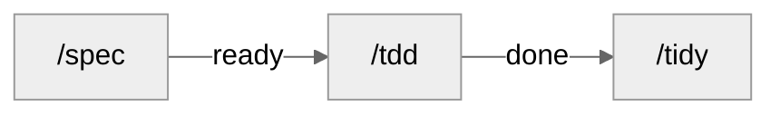

<div align="center">

# HysSkills

### Claude Code 工程技能包 · 单人开发 · 中文输出

[GitHub](https://github.com/SilentUniverse/HysSkills) · [Issues](https://github.com/SilentUniverse/HysSkills/issues)

[](https://github.com/SilentUniverse/HysSkills/stargazers)
[](https://github.com/SilentUniverse/HysSkills/commits/main)


一套为"失忆的 AI"设计的单人工程工作流。思考 / 代码用英文，对话用中文。  
需求、PRD、issue 都在 `.scratch/`。人干的事不进队列。Unix / WSL 同时保留。

</div>

***

## 设计思想

**AI 每次进场，都是一个失忆的新员工。** 它没有记忆，看不见你脑中的模块地图，读不到昨天的讨论。这套工作流的所有设计都从这一点出发。

**为冷启动设计。** 每张 issue 是自足的——`## 做什么` + agent 可自己跑的验收标准，只看卡片就能开工；会话开局自动加载 `CODEBASE.md` 结构地图；spec 收尾还有一道**冷读**：把每张卡当成一无所知的执行者重读一遍，AC 跑不动、依赖没写清，当场打回。

**用机制防漂移，不靠自觉。** `done` 的 issue 不可变，返工开 redo；需求推翻时不是悄悄改文件，而是 `PRD-v2` + 一份逐条对账报告（✓ 仍有效 / ⚠ 返工 / ✏ 改写 / 🗑 删除 / ➕ 新增）；`verify-artifacts.py` 机器门校验全部工件——frontmatter、依赖图无环、完成记录里点名的每个测试文件必须真实存在。测试被误删，gate 当场红灯。

**上下文是最贵的资源。** ~150k token 的 smart zone 是质量天花板，不是上下文上限。每个技能头 <100 行，细则拆成按需加载的子文件；切卡时计算**推理半径**——这张卡要读几个模块才能确信正确，半径就是它以后每一次执行的 token 成本；会话边界五问有序：Continue → `/clear` → `/handoff` → subagent → `/compact`，有损的压缩永远排最后。

**九个词的设计原则。** First Principles · Invariant · Parsimony · Locality · Provability · Adversarial Review · Empiricism · Reversibility · Evolution——不给 AI 编码规范，给它九个能自己推导出好代码的问题。压缩规则住全局 `CLAUDE.md`，定义与出处住一个按需加载的[词表](claude/design-principles.md)。

**深模块：接口留给品味，实现交给 AI。** 大量行为收进一个小接口，测试锁死接口行为——实现随便 AI 怎么写，红灯会说话。接口在文件置顶（类型先行，实现后看）；目录结构就是模块地图，地图和目录对不上，本身就是架构问题。

**人是裁决者，不是流水线工人。** 关批报告一屏五块：结果计数、frontier（每张未完成卡一行：被谁阻塞）、待裁决、等你验证（每项带可直接粘贴的命令）、详文指针；PRD 定稿只审"测试决策 + 范围外 + AC 标题"——抓错最便宜的两处。`/atk` 双态：工作流里自动跑的只有**审查**（发现进待决），你手动敲 `/atk` 才有**逐条讲解**——每个改动是什么、为什么，一条一行，逐条裁决。所有给你看的发现都是固定形状——位置、原句、问题、处置，一句一行；探针模式、分类号这类机器读数永不出现。

**全集必清零。** 任何"全部 / 所有 / 逐个"任务，先用工具枚举全集（grep / ls / git diff），绝不凭记忆；每项要么完成、要么写明不动的原因；收尾重跑枚举命令验证残留为零，报告以 N/N 结束——每个结论带 file:line 或命令输出作证据。

**能并行的都在并行。** spec 定稿前，外部事实类问题同轮 fan out 给后台 research（上限 3）；`/tdd -p` 按依赖分波次并行，预测到撞同一测试文件的卡自动串行成先后波；关批时全量 suite、Standards 轴、Spec 轴三个只读子代理同轮齐发。

**一切闭环，没有僵尸状态。** handoff 一份生产一次消费，`/resume` 完成即删（git 留历史）；done 攒够 `/tidy` 归档成 SUMMARY；说不清的问题停在 PRD 的雾区，不假装精确；每张卡落在点名的接缝上，AC 穿过接缝跑。

27 个技能、一道机器门、九个词——所有规则只为三件事：**更少的 token、更快的交付、可逐条审查的质量。**

---

## 安装

### Windows

1. clone 仓库：

```
git clone https://github.com/SilentUniverse/HysSkills
```

1. 打开仓库根目录，**双击 `install-oneclick.cmd`**。

### macOS / Linux

```bash
git clone https://github.com/SilentUniverse/HysSkills
cd HysSkills
bash install.sh
```

装完新开 Claude Code 会话，敲 `/` 能看到 27 个 skill 即成功。

安装会：把每个 skill 链接到 `~/.claude/skills/<name>`（Windows junction / Unix symlink；改仓库即生效；已有同名目录备份到 `_backup-<时间戳>/`）；拷贝 `claude/CLAUDE.md`、references、hooks 到 `~/.claude/`；分发 `ARTIFACT-FORMAT.md`。

<details>
<summary>可选：护栏 hook、现代 CLI、只要全局规则</summary>

**护栏** — 安装只分发脚本，接线写 `settings.json`，见各自 SKILL.md：

- [git-guardrails](misc/git-guardrails-claude-code/SKILL.md) — 拦 `push` / `reset --hard` / `clean -f` / `branch -D` / `checkout .`
- [modern-cli-guardrails](misc/modern-cli-guardrails/SKILL.md) — 拦宿主 `grep` / `find` / `ls` / `sed`

**现代 CLI** — `yq`、`ast-grep` 等；没有也能靠内置 Grep / Read。[CLAUDE.md §7](claude/CLAUDE.md)

```
winget install -e --id BurntSushi.ripgrep.MSVC --id sharkdp.fd --id sharkdp.bat --id MikeFarah.yq --id ast-grep.ast-grep --id chmln.sd
```

缺 `jq`：`jqlang.jq`。macOS：`brew install ripgrep fd bat jq yq ast-grep sd`。

**只要全局规则：**

```
curl.exe -fsSL https://raw.githubusercontent.com/SilentUniverse/HysSkills/main/claude/CLAUDE.md -o "%USERPROFILE%\.claude\CLAUDE.md"
```

```bash
curl -fsSL https://raw.githubusercontent.com/SilentUniverse/HysSkills/main/claude/CLAUDE.md -o ~/.claude/CLAUDE.md
```

已有自定义 `CLAUDE.md`：按编号补缺的节，别整文件覆盖。

</details>

---

## 工作流



| | 做什么 |
|---|---|
| `/spec` | 落档、拆 issue。不写代码 |
| `/atk` | 对抗审查。spec 收尾自动跑；手动敲另有逐条讲解 |
| `/tdd` | 红绿，写代码 |
| `/tidy` | 归档 `done`，重生成 `SUMMARY.md` |

**/spec**

- 小而清晰：跳过 PRD 直拆（`## 上级` 自带上下文）
- 会改卡的决定才问；ADR 级 → `/grill`；外部事实不问你——同轮 fan out 给后台 research（上限 3）
- 已有功能：没推翻已记录的 AC/决策 → detail / 改 `ready`；推翻了 → `PRD-v2` + 对账；跨特性先问一句
- 已有代码：影响面探测
- 写不出自足卡（`## 做什么` + AC）就不是独立 issue；AC 从不变量推导，穿过点名的接缝跑
- agent 跑不了的验证 → PRD 端到端验证
- 有真设计权衡 → 先 `/prototype`
- 实现决策先写不变量；单向门（ABI / schema / 协议）单独标出吃最重审查
- 收尾冷读每张卡；写了 PRD 或 ≥5 张卡 → 自动 `/atk` 审查，发现进待决
- PRD 是意图快照，推翻已记录的 AC/决策才写新版本；防漏靠切片 quiz 和 AC，不是 PRD

**/atk**

- spec 收尾自动调（写了 PRD 或 ≥5 张卡）——审查态，只产发现：能推翻卡片的进待决，其余当场修
- 手动 `/atk` ——审查 + 逐条讲解，一条改动两行（改了什么 / 为什么）；默认讲上一轮增量，`--all` 讲全部未提交
- 攻法正反两向：正向以使用者身份走每条入口→指针→链路；反向对前身逐条对账——旧版每条规则仍是"仍在 / 已迁移且可达 / 有理由删除"三态之一

**/tdd**

- 一条 / 裸跑排空 / `<feat>` 串行；`-p` 并行（撞同一批文件才用 worktree）
- `--log`：车机 / 设备，验收是命令的 log 文件
- 人验在 PRD 端到端验证；批末全量 suite + build + 双轴审查 + 一屏五块报告；done 攒够 → `/tidy`

**/tidy**

- `done` 进 `issues/archive/`（不改 body）
- 重生成 `SUMMARY.md`
- 审计僵尸 / 重复测试 + 孤儿 issue

需求又变 → 再 `/spec`。只加一块 → detail。重大方向反转先 `/grill` 写新 ADR，旧的标 `Status: superseded`。`done` 不动，要改就 `NN-redo-X.md`。

全长链不是必经管道，见下面怎么喊。

---

## 怎么用

| 场景 | 敲 |
|---|---|
| 新需求 / 改已有需求 | `/spec <需求>` |
| 做一条 issue | `/tdd <path>` |
| 排空一个 feature 的 ready | `/tdd <feat>` |
| 车机 / 设备，验收在 log 里 | `/tdd --log` |
| 上一 session 留了 handoff | `/resume` |
| 做到哪了 | 自己跑 `rg '^status:' -g '**/issues/*.md' .scratch` |
| 想听 AI 逐条讲它改了什么 | `/atk`（默认讲上一轮增量；`--all` 讲全部未提交） |
| 文档 / 技能文件改完 | `/lint <文件>` 查视角泄漏 |
| 5 轮内能收尾 | `/compact`（grill→spec 之间禁止） |
| 还有半天 / 换任务 | `/handoff` + `/clear` |

能传路径就别让 agent 扫仓库。别把 PRD / issue 粘进对话。

### 改已有功能

`/spec "给订单加部分退款"` 会先做**影响面探测**：`rg` / `ast-grep` 查引用；小半径一行带过；真耦合才出报告（模块、可能回归的行为、哪些测试预期要改）。宽重构 expand → contract。grep 看不见的 invariant 落该区 `CODEBASE.md` 块。Python 等动态语言会标明静态查不全。命令：[impact-detection.md](engineering/spec/impact-detection.md)。

| issue | |
|---|---|
| `ready` | 直接改 / 加 / 删文件 |
| `done` | 不可改。`/spec` 出 redo → `/tdd` |

架构整体反转：先 `/grill` 写新 ADR。

### 切 session

| | |
|---|---|
| 5 轮内能收尾 | `/compact`（grill→spec 之间禁止） |
| 还有半天 | `/handoff` + `/clear` |
| 读大文件 / 陌生模块 | subagent，只回报结论 |
| 做一半换任务 | `/handoff` → `/clear` → 新 session |

`/resume` 找最近 `status: active` 的 handoff，对 `git_base`，按开机序列续，收尾**直接删除文件**——一份 handoff 一次消费，不堆积（git 留历史）。上一 session 已完整结束 → 不要写 handoff，直接 `/tdd` 下一条。长任务每天收工前一份；跨 session 的 epic 每次切换前一份。

### 状态

| | |
|---|---|
| `ready` | 写清楚了，可派发 |
| `done` | 不可改。返工新建 redo |

人手验证（品味、外部账号、人眼）记在 PRD 端到端验证。车机 / 设备走 `/tdd --log`。没有 inbox / blocked / shelved。

```bash
rg '^status: ready' -g '**/issues/*.md' .scratch
```

单字段：`yq --front-matter=extract '.status' <file>`。已建成 → `SUMMARY.md`。历史 → `issues/archive/`。

---

## 接入一个项目（跑一次）

**从 0 到 1**

1. `/hys-setup`（默认：本地 markdown / 两态 / 单 context）→ `docs/agents/` + `CLAUDE.md` 的 `## Agent skills`
2. `CONTEXT.md` + `CODEBASE.md`（见下）
3. 护栏按需：[git-guardrails](misc/git-guardrails-claude-code/SKILL.md)、[modern-cli-guardrails](misc/modern-cli-guardrails/SKILL.md)、[setup-pre-commit](misc/setup-pre-commit/SKILL.md)

**接收已有项目** — 先建地图，少让 agent 反复扫代码。

1. `/domain-modeling` 术语表 + `/zoom-out` 结构地图（都有 draft：一次起草、一次审）。临时看一块：`/zoom-out <path>`，默认只读
2. `/hys-setup` 识别旧状态机、非默认路径、旧 `Status:` 行，确认后落盘
3. 护栏同上

### 文档放哪

| | 位置 | 放什么 |
|---|---|---|
| 项目级 | 仓库根 | `CONTEXT.md` 术语、`CODEBASE.md` 结构地图 |
| 长期 | `docs/` | `docs/adr/`、`docs/agents/`（`domain.md` 缓存测试 / 构建 / 影响面 / 性能测量命令） |
| 工作态 | `.scratch/<feat>/` | `PRD.md`、`issues/`、`SUMMARY.md`、`handoff.md`（`tmp/` 被 ignore） |

完整目录契约（一棵树 + 命名规则）：[ARTIFACT-FORMAT.md](engineering/ARTIFACT-FORMAT.md)。

`CONTEXT.md` 只写概念，一两句，不带路径、不带实现：

```markdown
## Account（账户）
持有余额的实体。
_Avoid_: Wallet, balance-holder
```

`CODEBASE.md` root：综合段（≤5 句）+ 非显然路由 + 分区 roster（一行一区、≤10 词）。正文 ≤40 行。细节在 `src/<area>/CLAUDE.md` 生成块（≤8 行）。每行：`rg` 不出来 **且** 缺了会咬人。

```markdown
<!-- BEGIN GENERATED codebase (/zoom-out) -->
git_base: 7af387c
- 余额扣减必须查 frozen 标志，真入口是 `withdraw`（`_debit` 是私有的）
<!-- END GENERATED codebase -->
```

### 不要破坏

1. `done` 不可改 → 新建 `NN-redo-X.md`
2. 推翻已记录的 AC/决策 → `PRD-v2.md`，旧的不动；纯增量 → detail / 改 `ready`，不动 PRD
3. AC 只写本切片新行为；前置靠 `blocked_by`。tdd 跑前会跳过已覆盖的 AC

---

## 低频

**ADR** 只在两处提议：`/grill`（三条标准见 `engineering/domain-modeling/ADR-FORMAT.md`）；`/improve-arch`（你否决一个重构且理由有分量）。`CONTEXT.md` 记是什么，`CODEBASE.md` 记 grep 拿不到的，`docs/adr/` 记为什么。

**少烧 token**

1. `CLAUDE.md` / `SKILL.md` 保持稳定
2. 大文档另开 session 或 subagent
3. 别把 PRD / issue 粘进对话
4. 整文件读优于多次摸索
5. 环境可查的（package.json scripts、目录树、`--help`）不写进文档——拷贝是会过期的缓存

会话边界顺序：Continue → `/clear` → `/handoff` → subagent → `/compact`（[PHASE-BOUNDARIES.md](claude/PHASE-BOUNDARIES.md)）。开机加载写在全局 CLAUDE.md §6。单 / 多 context 在 `docs/agents/domain.md`。

**栈** — 测试命令、ADB、影响面探测写进 `docs/agents/domain.md`：

```markdown
## 影响面探测命令（impact detection）
- 受影响代码：`pyright --outputjson` + `rg '\bSYM\b'`
- 受影响测试：`pytest --testmon`
- import 图：`grimp`
```

其他语言：[impact-detection.md](engineering/spec/impact-detection.md)。

---

## skill

| | 何时用 |
|---|---|
| [hys-setup](engineering/hys-setup/SKILL.md) | 项目首次接入；Case 5 迁 frontmatter |
| [grill](engineering/grill/SKILL.md) | 拷问方案。[grilling](productivity/grilling/SKILL.md) + [domain-modeling](engineering/domain-modeling/SKILL.md) |
| [prototype](engineering/prototype/SKILL.md) | `/spec` 前造一次性原型 |
| [spec](engineering/spec/SKILL.md) | 规划：只写 PRD / issue |
| [atk](engineering/atk/SKILL.md) | 对抗审查自己的产出；工作流只调审查方向，讲解仅手动触发 |
| [tdd](engineering/tdd/SKILL.md) | 写代码；`--log` 读设备 log。[DRAIN.md](engineering/tdd/DRAIN.md) |
| [tidy](engineering/tidy/SKILL.md) | 归档、SUMMARY、僵尸测试 |
| [diagnose](engineering/diagnose/SKILL.md) | 硬 bug / 性能回归 |
| [merge-conflicts](engineering/merge-conflicts/SKILL.md) | merge / rebase 冲突 |
| [zoom-out](engineering/zoom-out/SKILL.md) | 地图视角；可落盘 `CODEBASE.md` |
| [lint](engineering/lint/SKILL.md) | 视角审查：这句话离开写它的会话还成立吗 |
| [write-skill](productivity/write-skill/SKILL.md) | 写 / 改技能；改完验收三连 `/atk` + `/lint` + `wc -l` |
| [record-gif](engineering/record-gif/SKILL.md) | UI 录成验证过的 GIF |
| [research](engineering/research/SKILL.md) | 后台调研 |
| [improve-arch](engineering/improve-arch/SKILL.md) | 架构回顾。[codebase-design](engineering/codebase-design/SKILL.md) |

**引擎**（也可单独喊）

| | 承载 | 单独喊 |
|---|---|---|
| [grilling](productivity/grilling/SKILL.md) | 采访循环 | 临时想清楚一件事 |
| [domain-modeling](engineering/domain-modeling/SKILL.md) | 术语 / ADR | 只补表或一条 ADR |
| [codebase-design](engineering/codebase-design/SKILL.md) | deep-module 词汇 | 设计单个模块接口 |
| [code-review](engineering/code-review/SKILL.md) | Standards + Spec | 评 diff / 分支 / PR |

**其他：** [handoff](productivity/handoff/SKILL.md) · [resume](productivity/resume/SKILL.md) · [caveman](productivity/caveman/SKILL.md) · [teach](productivity/teach/SKILL.md)

**一次性：** [git-guardrails](misc/git-guardrails-claude-code/SKILL.md) · [modern-cli-guardrails](misc/modern-cli-guardrails/SKILL.md) · [setup-pre-commit](misc/setup-pre-commit/SKILL.md) · [migrate-to-shoehorn](misc/migrate-to-shoehorn/SKILL.md)（仅 TS）

---

## 维护

| | |
|---|---|
| 改完 CLAUDE.md / references / hooks | Windows 再双击 `install-oneclick.cmd` |
| 改 skill | 改仓库即可（junction） |
| SKILL.md | <100 行；超了按 [write-skill](productivity/write-skill/SKILL.md) 拆；改完跑 `/atk` + `/lint` + `wc -l` |
| 改 hook | 先跑 `test-block-legacy-cli.ps1` / `test-block-dangerous-git.ps1` |
| 改 verify-artifacts | 跑 `test-verify-codebase.ps1` |
| 契约 | [ARTIFACT-FORMAT.md](engineering/ARTIFACT-FORMAT.md) |

每个文件有读者；每个状态有闭环；每个入口有守门。
