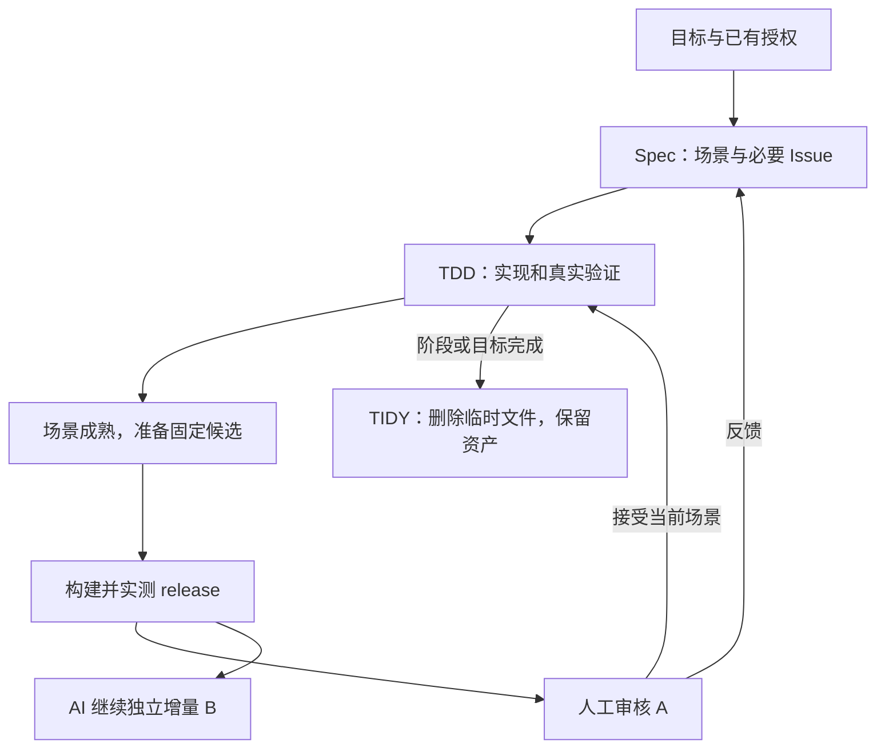

# 增量协作：Spec、TDD、TIDY

本文定义 schema-3 增量工作流。执行入口与字段见 [BATCH-FORMAT](../workflow/tdd/BATCH-FORMAT.md)，
开发者操作见[日常使用说明](checkpoint-local-release.zh.md)，实际验证边界见
[测评与证据](checkpoint-workflow-review.zh.md)。确定性检查不等于真实模型的速度或质量收益。

## 目标和入口

优先保证产物质量，其次缩短完整交付时间，再减少 token。固定版本可审、反馈不丢、完成证据
可追溯、临时文件实际清理，都是完成条件。没有 UI 的任务不加载 UI 专属规则或运行浏览器。

| 入口 | 职责 | 使用边界 |
|---|---|---|
| Spec | 需求、场景、Issue、就绪条件、决定依赖及计划修订 | 只要方案就交方案等待；直接实施请求携带既有授权继续 |
| TDD | 在当前目标内实现、真实验证、协调 worker、交付版本、处理反馈 | 裸命令默认当前目标；全仓要明确授权；`-all` 仍指全量检查 |
| TIDY | 展示当前工程及人工义务，清理确认无用的临时文件 | 默认当前目标；`inspect` 只查看；范围不明时不误删其他 feature |

没有单独的 Flow 用户入口。运行器内部的 batch 管理累计预算、计划版本和执行证据。
小而明确、无需持久协调的工作可以内联完成；无需为所有任务创建 PRD 或批次。

## 信息归属

| 信息 | 权威归属 |
|---|---|
| 目标、产品约束、成功标准、共享决定 | PRD 或内联已确定需求；批次保留实际需求正文 |
| 工程任务、AC、依赖、验证入口、测试所有权 | Issue；需要拆卡才建立 |
| 哪些行为可以组合后请人判断 | 版本化场景和审查点 |
| 固定源、实际包、机器结果、人工观察 | 不可变 checkpoint、receipt 和 review |
| 运行中的分配和交给 worker 的输入 | execution ledger、绑定任务包与 admission 记录 |
| 临时文件及长期资产 | 产生时登记的 owner、purpose、lifecycle、consumers |

PRD、Issue、审查点是多对多关系。解析、缩略图和导入进度三张卡可以组成“导入素材”一个
可审场景；同一解析能力又可以支撑搜索场景。完成一张卡不等于必须请人，也不必等整个 PRD
完成才请人。场景的本轮审查责任只有一个 owner，避免重复的接受状态。

Issue 工程状态只有 `pending`、`ready`、`done`。Pending 必须写明工程就绪缺口；ready 表示
约定和验证准备妥当，仍可能等上游、资源或决定；done 表示工程证明完整。人工状态单独记录
preparing、pending、accepted、changes_requested、withdrawn，不能把人还没看误写为工程未完成。

## 什么时候请人

实现前，只有未定且会改变产品结果、权限、范围或显著成本的 choice 才需要人决定。
同范围已经授权的实现、拆卡和修复不重复征求许可。未决决定只阻塞它的真实消费者。

正式审核必须同时满足：场景工程前置完成、声明的机器检查通过、固定包及其完整入口已实测、
运行与清理终态有证据、人工步骤明确、版本和义务仍有效。构建失败或未完成的候选不能靠一次
人工批准变成通过。就绪通知与 review 在同一事务中发布；通知已送达不代表用户已读或已接受。

运行器优先处理已成熟的交付，再继续无关的新任务。主 Agent 不必永远闲着监督，也不能把
全部协调留到自己的长任务结束。普通宿主在有界安全点处理事件；显式 host 通知适配器配合
后台检查时，机械推进可以在实现进程忙碌期间完成投递。默认 parent-turn 只承诺下一安全点
通知。没有通用的“唤醒任何已关闭宿主”能力，也没有模型轮询心跳。

共享源码树仍然一次只有一个活动 wave。封存需要整波实际交回；已封存候选的检查与交付可以
和下一波写源码并行。所有 worker 满员而主控没有安全工作时等待实际事件，不重复实现或忙轮询。
通知前置成立、封存、交付和宿主确认时间均保留，便于核对构建和排队成本。

## 人审 A，AI 写 B

A 的接受绑定 checkpoint、真实 artifact、场景版本和 review revision；无关 B 的批次修订不
使 A 误失效。来自过期、撤回或被改写场景的批准被拒绝。每个场景可以单独给结论，实际人工
步骤必须留下观察；Agent 不能自签人工通过。

上游证明或决定变化沿工程和决定依赖传递。派工绑定需求正文、约定、证明与决定，任务包
携带对应版本的决定说明和值；harness 必须实际传给 worker。检查单独绑定其输入，完成
时不能补绑最新决定。过期 worker 交回后需要重新核对；只有输入过期的检查可以同源码重验，
真正的产品失败不会被重试 epoch 清洗。

最终组合版本执行声明的组合检查。人工结论沿用必须核对实际包、启动约定、环境及完整影响
输入，不能用“源码相同”替代“包相同”。包变了就重审相关场景。若 final 使用另一构建链，
计划需要明确 `final_checks` 对应关系并实际执行；缺失时保留待补验证义务，不发伪 green。
固定最终包上的场景重审复用已验证的包，避免再构建早期包形成循环。

## 需求完成后又变化

| 变化 | 工程处理 | 历史与审查 |
|---|---|---|
| 原约定内缺陷、活动目标尚未交付 | 定位后定向 repair；保留受影响 proof 历史，重验依赖链 | 原反馈和相关人审义务继续存在 |
| 不推翻原约定的新细节 | 关联 detail；尚未执行的卡可在授权内补充 | 保留原完成，新增部分按可审场景判断 |
| 改变行为、范围或权限 | 更新需求/场景版本，已完成部分建 redo | 已经做对的旧要求不会被改写成“当时没做完” |
| 目标已经关闭后的缺陷或新要求 | 新建关联 fix/后续目标 | 关闭记录不原地改写 |
| 缩小本轮范围 | 追加有理由的取消/退役记录 | 不伪造 done 或 accepted |

计划修订追加而不覆盖，累计预算、失败和执行记录不重置。受影响的在途 worker 要先交回，
独立工作不必停；活动检查与待封存请求需先对齐。可用的旧 runtime 继续自己的批次，新协议不
自动升级活动状态。跨宿主活动迁移需显式处理工作区和进程所有权。

## 预览与反馈

源码预览直接跑原仓库、使用现有依赖、允许持续写入。启动任务显示 cwd、argv 和参考节点，
不会复制依赖、迁移源码、封存或自动构建。这是开发中的实时观察，不能作为固定版本接受。

反馈保留真实来源：固定审核记录版本与场景；live preview 记录观察时间/会话、已知参考和证据，
允许实际版本不确定；需求反馈不强填运行 ID。AI 复现并定位到受影响 Issue，用户不用查编号。
未解决反馈保护相关临时材料。解决要有当前约定和源码上的真实验证；涉及人工场景时还要有
反馈之后的实际接受，不能拿反馈之前的批准结案。

## 可复用经验与 TIDY

回归测试放到项目测试目录，必要数据放到夹具归属处，可复用操作保留为测试工具或相关验证
说明。只沉淀后来会用且难以从测试/代码恢复的经验，避免给每次尝试再写一份总结。

Issue 的完成证明包含实际约定与需求正文、手动步骤、真实 job、receipt/log、消费的上游证明
和决定事件。Schema 3 把这些发布到 feature 的 `receipts/managed` 对象闭包。把它与 Issue 历史
一起保留，可以脱离 batch 缓存验证历史。缺对象或摘要不符时不迁移、不伪造完成。
批次外已完成依赖也保留其原约定与验证结果；已有 managed 证明包含对象闭包。Legacy 的
done 声明只作为历史前提保留，不升级成机器验证证明。

临时文件在产生时登记，通用清理范围是归属明确的 feature scratch 和受管 run-data。实际删除
须满足 producer 已释放、无活动执行或消费者、非长期资产、身份和内容未变。apply 在同一
状态锁下重查；unlink 前持久化逐文件意图，崩溃重入核对实际删除。链接、junction、路径别名、
被改文件、跟踪中的源码和不明消费者均保留；只移除空目录。

受管执行目录的私有依赖可以随该执行回收，开发目录的共享依赖不属于这种临时文件。
固定 review 包、完成证据、未解决反馈、测试和经验持续保留；approve 不释放可能仍在运行的
应用。通用 GC 对交付包采用保守持久保留，无需用户手填运行租约。当前没有自动删除历史
release 的保留期策略。任务完成时执行局部清理；用户也能主动 `/tidy feature`。

## 平台、成本和边界

构建/启动通过显式 argv 适配 PyInstaller onefile/onedir、Node 官方 SEA + esbuild、已有 exe、
安装器及其他工具链。GUI/服务由 application 生命周期启动，harness 验证行为，再确认终态。
签名或安装转换后的最终字节要重新取得相应证据。各 OS/CPU 原生构建验证，不能拿 macOS 包
证明 Windows 通过；源码路径和协议本身使用跨平台锁、Python 路径 API 与受管进程所有权。

打包只安排在交付或必要的包检查节点；重复查看使用已有产物，完成证据只在固定候选、检查及完整环境契约一致时显式复用。
复制、hash、归档、状态保护仍有成本。普通非 UI 路径的 UI 文档/模块/探测/安装/进程成本为 0。
模型 token 和吞吐必须取 provider 实测；CLI 耗时及本地 tokenizer 不能代替。

## 验收场景

下表定义目标场景，不自动表示已经在每个平台逐项实测。具体证据与未运行范围分开记录。

| 编号 | 场景 | 预期 |
|---|---|---|
| V01 | 一个 PRD、多 Issue、多审查点；以及无 PRD 小任务 | 关系可追溯，小任务不新增强制流程 |
| V02 | 后端卡 done，但组合 UI 尚不可审 | 卡保持工程完成；未成熟场景不通知假就绪 |
| V03 | 所有卡 done，仍有必需人工检查 | 目标不关闭，默认视图显示待审 |
| V04 | 人审 A；B 无决定依赖，C 依赖 A 接受 | B 可推进，C 保持等待；写入／资源冲突仍受控 |
| V05 | AI 已写 B，用户迟到批准 A | 仅改变 A 对应场景的决定，不接受 B 新内容 |
| V06 | 两个独立审查请求，部分场景退回或 A 已撤回 | 不串决定；撤回后的批准拒绝，反馈可保留 |
| V07 | 单个场景反馈，阶段有多个已完成 Issue | 定位后只修相关卡，无关证明与工作保留 |
| V08 | 旧反馈已在当前版修复／反馈改变原约定 | 分别关联实际修复或场景新版本，不重复返工或改写历史 |
| V09 | 原仓库源码服务启动时 worker 仍在写，并提交无固定请求 ID 的反馈 | 继续运行；反馈可记录并复现，不强绑旧 release；无源码迁移／停写要求，不形成固定版本 credit |
| V10 | 同版重复查看／运行／导出；UI A 误连接正在变化的开发服务 B | 正常复用不重复构建；错误服务绑定被拒，不只检查前端包哈希 |
| V11 | 场景结论沿用但相关资源、依赖或约定改变 | 沿用被拒；只对需要范围重新验证／审查 |
| V12 | 追加计划、重试、反馈修复、runner 重启；I1→I2→I3 的上游失效且无关 I4 在运行 | 消费累计、旧执行绑定不变；受影响证明重验／协调，无关 I4 继续，未完成义务不消失 |
| V13 | 决定依赖和工程依赖形成环 | 执行前明确拒绝，不进入永久等待 |
| V14 | 普通克隆／换目录；未提交的 R1@1 已被 R1@2 替换并清理旧运行目录 | 可离线还原旧成功标准与人工步骤并核验历史；不依赖原 inode/batches；活动任务不被错误恢复 |
| V15 | 持久证据缺文件、摘要不符或迁移中断 | 不伪造完成，保留原证明／缓存并可恢复迁移 |
| V16 | 同一反例在下一张卡再次相关 | 复用已有测试／场景；不重读全部历史或新增重复总结 |
| V17 | Issue 产生多种临时文件和一个回归测试 | 临时文件实际删除；测试、必要夹具及经验保留 |
| V18 | GC 预览后新增引用、产生文件、文件被改或仍被进程占用 | apply 重查并保留变化对象，不用旧清单误删 |
| V19 | 目录有隐藏文件、外链、Windows junction、共享消费者 | 不越界；未确认子项保留；最后一个消费者释放后才回收 |
| V20 | GC 在部分删除后崩溃重启 | 重入幂等，报告实际删除，不重复扣状态或丢失保留关系 |
| V21 | 待审包／反馈仅由 done Issue 关联；批准后应用仍在运行或手动启动状态未知 | 清理后仍可运行／复现；待人义务和实际运行占用分别保留，不因批准误删资源 |
| V22 | 包已输出正确结果但异常退出或留下后代／资源 | 继续拒绝完成，不能因新调度放宽既有终态要求 |
| V23 | 纯非 UI 任务经过普通实施、投影与 TIDY | UI 文档读取／导入／探测／安装／进程／重试均为 0 |
| V24 | macOS/Linux/Windows 的基础、UI、打包与 GC | 各自原生验证；平台跳过不记通过，人工／真机条件单列 |
| V25 | 主控自己的任务尚未结束，但另一场景已可交付 | 交付准备获得执行机会；支持独立投递的宿主不等待主控模型结束才展示审核卡 |
| V26 | 子 Agent 持续完成并增加无关工作，某审查点的前置条件已经满足 | 审查交付不被饿死；等待封存／构建的时间可见，未验包完成前不通知假就绪 |
| V27 | 就绪提交、通知发送或宿主确认时崩溃 | 同一事件可恢复投递；接收端按 ID 去重；不漏掉待审，不把已发当作已读／批准 |
| V28 | 通知排队时版本撤回；或宿主不支持后台投递／已经关闭 | 旧批准无效；受限模式如实呈现，恢复后先处理有效待投递事件 |
| V29 | 所有子 Agent 忙，主控暂无安全实施任务 | 优先完成实际所需协调；无事则等待事件，无忙轮询、重复实施或额外模型心跳 |
| V30 | plan-only、直接实施、接受后追加同约定卡片、明确改变需求 | 按实际授权交接；plan-only 不实施，同范围不重复审批，实质未决只阻塞相关工作 |
| V31 | 多 feature 下裸 TDD／TIDY、命名范围、只检查和明确全仓请求 | 默认当前目标；缺目标不误派／误删；TIDY 清理确有删除结果；`-all` 仍只控制全量检查 |
| V32 | 缺少预检的 pending I1；ready I2 依赖 I1；以及 ready 的短暂环境漂移 | 无可派发工作时仍恢复 I1 的既定环境，不因存在受阻 ready 卡永久等待；不丢卡、不伪造通过 |
| V33 | Spec 要修改／退役一张运行中的 ready 卡或其共享验证输入 | 先协调受影响执行；旧 worker 不消费被悄悄改写的约定；独立工作继续 |
| V34 | 批次持续追加，已有场景可交付；人工通过后又修代码 | 可审候选先完成要求的组合验证；同候选共享活动检查，完成证据按明确环境契约复用；修复后相关证据重新取得 |
| V35 | 无关 feature 有坏卡；本任务临时文件可安全删除；另有共享引用不明文件 | 独立安全对象实际清理；不明对象保留；TIDY 无产品全量／浏览器／逐文件模型调用 |
| V36 | 用户缩小范围；关闭时另有用户正在运行的已交付包 | 追加明确取消记录，不造 done／accepted；完成必要清理，已移交应用及使用引用可持续存在 |

## 效果测评

先执行确定性回归、真实 UI/打包夹具，再对完整任务做可选模型 A/B。保留实施前的实际未提交
候选作为基线，不能仅用 HEAD 替代。本地量化使用 31 对交错顺序和 3 次预热，记录 p50/p95、
配对差值区间、输入/输出大小、真实清理字节。非 UI 专属 UI 成本必须为 0，受保护误删为 0。

端到端模型试验固定需求、起点、隐藏验收、模型、推理设置，先做非 UI 修复、异步人审、反馈
后 TIDY 三类各两次，新旧共 12 次；通过再扩为 8 类各三次共 48 次。人工等待、AI 空闲、返工、
构建/全量次数、通知延迟、用户手工切换次数单列，失败调用与全部 Agent usage 都计入。
先比较同等质量，再比较完整完成时间和 token；缺字段留 null。详见[测评方案](checkpoint-workflow-review.zh.md)。

## 测试增长的治理

Spec 维护行为、验证组、影响范围和触发约定；TDD 审查新增或改动测试的检测能力、稳定性及成本，
由主控统一共享验证；TIDY 只读既有测量并清理可丢弃输出。测试退役是正常工程变更。
性能基线、进程超时和原目标累计预算分别约束性能、挂死与重复消耗。缺少比较样本不能判为
性能通过。具体机制、开发者用法及测评步骤见[测试治理](test-governance.zh.md)。
